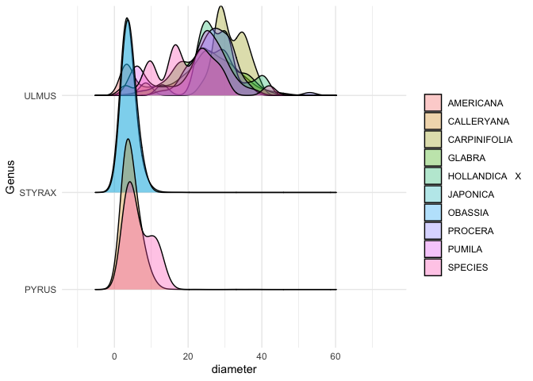
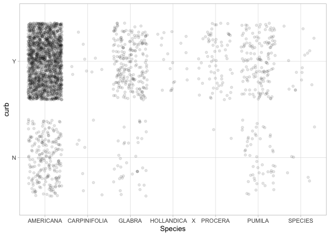

STAT545A Individual Mini Data Analysis-Milestone 2
================
Sara Kowalski
October 19, 2021

## Table of Contents

1.  Introduction

2.  Load packages

    -   2.1 Load **datateachr** and **tidyverse**

3.  Task 1: Process and summarize *vancouver_trees*

    -   3.1 My 4 research questions
    -   3.2 Summarizing and graphing
        -   3.2.1 Question 1
            -   3.2.1.1 Summarizing
            -   3.2.1.2 Graphing
        -   3.2.2 Question 2
            -   3.2.2.1 Summarizing
            -   3.2.2.2 Graphing
        -   3.2.3 Question 3
            -   3.2.3.1 Summarizing
            -   3.2.3.2 Graphing
        -   3.2.4 Question 4
            -   3.2.4.1 Summarizing
            -   3.2.4.2 Graphing
    -   3.3 Reflect on results

4.  Task 2: Tidy *vancouver_trees* dataset

    -   4.1 Is *vancouver_trees* tidy?
    -   4.2 untidy, then tidy back *vancouver_trees*
    -   4.3 Choose 2 research questions
    -   4.4. Choose a version of *vancouver_trees*

## 1 Introduction

Hello! The following document contains the work required to complete
Milestone 2 of the Mini Data Analysis Project in STAT545A. Here I will
be using R, and more specifically the tidyverse packages within R, to
summarize and visualize/graph the data within the *vancouver_trees*
dataset. By the end of this document I will have chosen 2 research
questions to continue to explore in Milestone 3 and generated a version
of my data that will help me to best answer those questions.

Much of the inspiration for this script comes from [Heads or
Tails](https://www.kaggle.com/headsortails/tidy-titarnic) and from the
[instructions](https://stat545.stat.ubc.ca/mini-project/mini-project-2/)
provided for the project.

## 2 Load Packages

### 2.1 Load **datateachr** and **tidyverse**

``` r
## Load dataset package - datateachr
library(datateachr)

## Load tidyverse - a collection of R packages used for data analysis
library(tidyverse) 
```

    ## ── Attaching packages ─────────────────────────────────────── tidyverse 1.3.1 ──

    ## ✓ ggplot2 3.3.5     ✓ purrr   0.3.4
    ## ✓ tibble  3.1.4     ✓ dplyr   1.0.7
    ## ✓ tidyr   1.1.3     ✓ stringr 1.4.0
    ## ✓ readr   2.0.1     ✓ forcats 0.5.1

    ## ── Conflicts ────────────────────────────────────────── tidyverse_conflicts() ──
    ## x dplyr::filter() masks stats::filter()
    ## x dplyr::lag()    masks stats::lag()

## 3 Task 1: Process and summarize *vancouver_trees*

### 3.1 My 4 research questions

-   Question 1: What is the distribution for tree species (from a
    specified genus (e.g. Ulmus)) within Vancouver neighbourhoods? Are
    certain tree species favored over others in specific neighbourhoods?

-   Question 2: How does the amount of trees planted change over time?
    Can go more in depth and look at how this changes within the
    different Vancouver neighbourhoods listed in the dataset. Or can
    look at how the number of trees planted changes for each genus or
    species over time. Can also look at a specific genus or species and
    see how the amount of trees planted changes over time within a
    specific neighbourhood or all the neighbourhoods in Vancouver.

-   Question 3: Within each genus, what is the distribution of the
    diameter of the trees for each species? Which species have a wider
    diameter distribution and which ones have a more narrow
    distribution?

-   Question 4: Which tree species are found planted on curbs? Does this
    vary by neighbourhood? Does the diameter of the tree determine
    whether it is planted on a curb (Y) or not (N) (i.e. large diameter
    trees would not be planted on curbs and smaller diameter trees would
    be)? Will have to group the trees by genus in order to pair down the
    dataset because for this question, it is too vast to look at in its
    entirety.

### 3.2 Summarizing and graphing

To explore the *vancouver_trees* dataset more in depth, I will use
various data manipulation techniques to help me complete a summarization
and graphing activity for each research question listed above.

#### 3.2.1 Question 1

##### 3.2.1.1 Summarizing

For this question it would be useful to know how many tree species there
are for a given tree genus and how many Vancouver neighbourhoods there
are in the dataset. Knowing these counts, I can determine how much data
I am working with and how big my graphs will be. This will help me to
determine the best way of presenting the data and inform my decision on
whether to subset the data further or not. With that being said, I will
use the *distinct* function from the *dplyr* package to determine the
amount of observations for the *neighbourhood_name* variable and the
*species_name* variable in the *vancouver_trees* dataset.

``` r
## first call the data set that will be used 
vancouver_trees %>%
## next call the distinct function and input the variable from the dataset you wish to know the count for 
  distinct(neighbourhood_name)
```

    ## # A tibble: 22 × 1
    ##    neighbourhood_name      
    ##    <chr>                   
    ##  1 MARPOLE                 
    ##  2 KENSINGTON-CEDAR COTTAGE
    ##  3 OAKRIDGE                
    ##  4 MOUNT PLEASANT          
    ##  5 RENFREW-COLLINGWOOD     
    ##  6 RILEY PARK              
    ##  7 DOWNTOWN                
    ##  8 SUNSET                  
    ##  9 ARBUTUS-RIDGE           
    ## 10 GRANDVIEW-WOODLAND      
    ## # … with 12 more rows

``` r
## repeat as necessary for any other variables within the dataset. 
vancouver_trees %>%
## I want to know the amount of distinct species within a particular tree genus so I will first filter
## the dataset to only contain trees from that genus 
  filter(genus_name == "ULMUS") %>%
  distinct(species_name)
```

    ## # A tibble: 7 × 1
    ##   species_name  
    ##   <chr>         
    ## 1 AMERICANA     
    ## 2 GLABRA        
    ## 3 HOLLANDICA   X
    ## 4 PUMILA        
    ## 5 PROCERA       
    ## 6 CARPINIFOLIA  
    ## 7 SPECIES

Based on the tibble outputs, there are **22 distinct neighbourhoods**
within the *vancouver_trees* dataset and **7 distinct species** within
the Ulmus genus in the dataset. I think it would also be interesting to
take this analysis one step further and see the count for the amount of
trees in each of the 7 disinct species in the Ulmus genus. Since each
row in the dataset is a tree, I can compute this using the function
*count*.

``` r
## call the dataset
vancouver_trees %>%
## filter the data so it only contains trees with the genus ULMUS 
  filter(genus_name == "ULMUS") %>%
## use the count function and input the variable you want the disinct values for
  count(species_name)
```

    ## # A tibble: 7 × 2
    ##   species_name       n
    ##   <chr>          <int>
    ## 1 AMERICANA       2252
    ## 2 CARPINIFOLIA      17
    ## 3 GLABRA           273
    ## 4 HOLLANDICA   X    20
    ## 5 PROCERA           74
    ## 6 PUMILA           203
    ## 7 SPECIES           22

Based on this further analysis, I can see that the species **AMERICANA**
has the most counts (2252) while **CARPINIFOLIA** has the least (17).

**In conclusion** : I have successfully determined the counts for the
amount of neighbourhoods within the dataset and the number of species
within the Ulmus genus while taking it a step further and determining
the amount of trees per species within the Ulmus genus. This
summarization exercise gives me a better idea at the amount of data I am
working with and how it could be further subsetted. For instance, I may
want to group the neighbourhoods into quadrants (north, west, east, and
south) and that way I can look at larger number of genus and species of
trees within each quadrant instead of each neighbourhood.

##### 3.2.1.2 Graphing

To start answering this question, I am going to plot a bar graph that
will look at the amount of trees for each species in the **STYRAX**
genus. I am also going to colour the bar graph by neighbourhood so that
it will become a stacked bar graph holding more information about where
trees are located and how many species of each tree are loocated in each
Vancouver neighbourhood. Further I am going to plot another bar graph
with the neighbourhood as the x-axis and the colour of the bars as the
species to compare and see which plot is cleaner and easier to
interpret.

``` r
## define a new place to hold the data to be graphed and call the dataset to be used
styraxGenus <- vancouver_trees %>%
## filter that data so it only contains trees with the STYRAX genus
  filter(genus_name == "STYRAX") %>%
## group the data by species_name in order to get the number of trees in each species
  group_by(species_name) %>%
## use the mutate function to add a new column that contains the count of trees for each distinct species 
## in the STYRAX genus
  mutate(numTrees = n())

## plot the data using ggplot, set x axis to species_name
ggplot(styraxGenus, aes(species_name, fill = neighbourhood_name)) +
## set the graph to a bar graph
  geom_bar() +
## define the x and y axis labels 
  xlab("Species") +
  ylab("Number of Trees")
```

<!-- -->

``` r
## plot the data using ggplot, set x axis to neighbourhood_name
ggplot(styraxGenus, aes(neighbourhood_name, fill = species_name)) +
## set the graph to a bar graph
  geom_bar() +
## define the x and y axis labels 
  xlab("Neighbourhood") +
  ylab("Number of Trees") +
## declutter the bottom axis by switching x and y 
  coord_flip()
```

<!-- -->

**In conclusion** : I have successfully plotted the graphs to compare
the amount of trees planted per species in the **STYRAX** genus within
each vancouver neighbourhood in the dataset. I found that plotting the
data with the neighbourhood on the y axis and the fill set to species
that the data was a lot easier to interpret and looked much cleaner.
This exercise has helped me to successfully answer my research question
one. To take this analysis further, I could try adding a graph for each
genus or for a select few genus’ by facet wrapping.

#### 3.2.2 Question 2

##### 3.2.2.1 Summarizing

For this research question, instead of looking at how trees planted
changes over time, I could look at how trees planted changes depending
on the 4 seasons: summer, fall, winter, and spring. More specifically, I
can look and see if there is a specific season in which trees are
preferably planted and see if this varies by neighbourhood or type of
tree (genus or species). A useful summarization activity for this
question would be to create a new categorical variable called *season*
from the date_planted variable to determine which season each tree was
planted in. For the purposes of this activity, I will define the 4
seasons as follows:

-   summer = July (7) - September (9)
-   fall = October (10) - December (12)
-   winter = January (1) - March (3)
-   spring = April (4) - June (6)

In order to do this I must first add a variable to the dataset called
*month* that will hold numerical data corresponding to the month that
each tree was planted based on the trees *date_planted* value. To ensure
reproducibility of the code and ease of comprehension, I will create a
new dataset called *numericMonth* which will store this added variable
*months* along with the original data from the *vancouver_trees*
dataset.

``` r
## define where the data created will be stored and which dataset will be used to create the new data
numericMonth <- vancouver_trees %>%
## add the new variable with the mutate function
## to access the month of each date use the months.Date function
## to further change the month into a numerical variable use the as.numeric and as.factor functions
  mutate(month = as.numeric(as.factor(months.Date(date_planted))))
## use the glimpse function to confirm the addition of the new variable - month
glimpse(numericMonth)
```

    ## Rows: 146,611
    ## Columns: 21
    ## $ tree_id            <dbl> 149556, 149563, 149579, 149590, 149604, 149616, 149…
    ## $ civic_number       <dbl> 494, 450, 4994, 858, 5032, 585, 4909, 4925, 4969, 7…
    ## $ std_street         <chr> "W 58TH AV", "W 58TH AV", "WINDSOR ST", "E 39TH AV"…
    ## $ genus_name         <chr> "ULMUS", "ZELKOVA", "STYRAX", "FRAXINUS", "ACER", "…
    ## $ species_name       <chr> "AMERICANA", "SERRATA", "JAPONICA", "AMERICANA", "C…
    ## $ cultivar_name      <chr> "BRANDON", NA, NA, "AUTUMN APPLAUSE", NA, "CHANTICL…
    ## $ common_name        <chr> "BRANDON ELM", "JAPANESE ZELKOVA", "JAPANESE SNOWBE…
    ## $ assigned           <chr> "N", "N", "N", "Y", "N", "N", "N", "N", "N", "N", "…
    ## $ root_barrier       <chr> "N", "N", "N", "N", "N", "N", "N", "N", "N", "N", "…
    ## $ plant_area         <chr> "N", "N", "4", "4", "4", "B", "6", "6", "3", "3", "…
    ## $ on_street_block    <dbl> 400, 400, 4900, 800, 5000, 500, 4900, 4900, 4900, 7…
    ## $ on_street          <chr> "W 58TH AV", "W 58TH AV", "WINDSOR ST", "E 39TH AV"…
    ## $ neighbourhood_name <chr> "MARPOLE", "MARPOLE", "KENSINGTON-CEDAR COTTAGE", "…
    ## $ street_side_name   <chr> "EVEN", "EVEN", "EVEN", "EVEN", "EVEN", "ODD", "ODD…
    ## $ height_range_id    <dbl> 2, 4, 3, 4, 2, 2, 3, 3, 2, 2, 2, 5, 3, 2, 2, 2, 2, …
    ## $ diameter           <dbl> 10.00, 10.00, 4.00, 18.00, 9.00, 5.00, 15.00, 14.00…
    ## $ curb               <chr> "N", "N", "Y", "Y", "Y", "Y", "Y", "Y", "Y", "Y", "…
    ## $ date_planted       <date> 1999-01-13, 1996-05-31, 1993-11-22, 1996-04-29, 19…
    ## $ longitude          <dbl> -123.1161, -123.1147, -123.0846, -123.0870, -123.08…
    ## $ latitude           <dbl> 49.21776, 49.21776, 49.23938, 49.23469, 49.23894, 4…
    ## $ month              <dbl> 5, 9, 10, 1, 3, NA, 3, 3, 3, 3, 3, 3, 3, 10, 10, 3,…

Now I can change the numeric variable *month* into a categorical
variable *season* that holds the 4 seasons (groups): summer, fall,
winter, and spring. I will store this in a new dataset called
*season_van_trees_planted*.

``` r
## define where the data created will be stored and which dataset will be used to create the new data
season_van_trees_planted <- numericMonth %>%
## use the mutate function to add the new variable season 
## use the cut function to create the categorical variable season with 4 groups (summer, fall, winter,
## spring) from the numeric variable month 
## winter(1-3), spring(4-6), summer(7-9), fall(10-12)
  mutate(season = cut(month, breaks = c(1,3,6,9,12), labels = c("winter", "spring", "summer", "fall")))

## use the glimpse function to confirm the addition of the new variable - season 
glimpse(season_van_trees_planted)
```

    ## Rows: 146,611
    ## Columns: 22
    ## $ tree_id            <dbl> 149556, 149563, 149579, 149590, 149604, 149616, 149…
    ## $ civic_number       <dbl> 494, 450, 4994, 858, 5032, 585, 4909, 4925, 4969, 7…
    ## $ std_street         <chr> "W 58TH AV", "W 58TH AV", "WINDSOR ST", "E 39TH AV"…
    ## $ genus_name         <chr> "ULMUS", "ZELKOVA", "STYRAX", "FRAXINUS", "ACER", "…
    ## $ species_name       <chr> "AMERICANA", "SERRATA", "JAPONICA", "AMERICANA", "C…
    ## $ cultivar_name      <chr> "BRANDON", NA, NA, "AUTUMN APPLAUSE", NA, "CHANTICL…
    ## $ common_name        <chr> "BRANDON ELM", "JAPANESE ZELKOVA", "JAPANESE SNOWBE…
    ## $ assigned           <chr> "N", "N", "N", "Y", "N", "N", "N", "N", "N", "N", "…
    ## $ root_barrier       <chr> "N", "N", "N", "N", "N", "N", "N", "N", "N", "N", "…
    ## $ plant_area         <chr> "N", "N", "4", "4", "4", "B", "6", "6", "3", "3", "…
    ## $ on_street_block    <dbl> 400, 400, 4900, 800, 5000, 500, 4900, 4900, 4900, 7…
    ## $ on_street          <chr> "W 58TH AV", "W 58TH AV", "WINDSOR ST", "E 39TH AV"…
    ## $ neighbourhood_name <chr> "MARPOLE", "MARPOLE", "KENSINGTON-CEDAR COTTAGE", "…
    ## $ street_side_name   <chr> "EVEN", "EVEN", "EVEN", "EVEN", "EVEN", "ODD", "ODD…
    ## $ height_range_id    <dbl> 2, 4, 3, 4, 2, 2, 3, 3, 2, 2, 2, 5, 3, 2, 2, 2, 2, …
    ## $ diameter           <dbl> 10.00, 10.00, 4.00, 18.00, 9.00, 5.00, 15.00, 14.00…
    ## $ curb               <chr> "N", "N", "Y", "Y", "Y", "Y", "Y", "Y", "Y", "Y", "…
    ## $ date_planted       <date> 1999-01-13, 1996-05-31, 1993-11-22, 1996-04-29, 19…
    ## $ longitude          <dbl> -123.1161, -123.1147, -123.0846, -123.0870, -123.08…
    ## $ latitude           <dbl> 49.21776, 49.21776, 49.23938, 49.23469, 49.23894, 4…
    ## $ month              <dbl> 5, 9, 10, 1, 3, NA, 3, 3, 3, 3, 3, 3, 3, 10, 10, 3,…
    ## $ season             <fct> spring, summer, fall, NA, winter, NA, winter, winte…

**In conclusion** I have successfully created a new categorical variable
called *season* with 4 groups: winter, spring, summer, and fall, out of
transformed date data. In further analysis, I would likely filter out
all the NA values from the data to clean it up or graph it with NA as
it’s own group. This summarization exercise will help to graph the data
when I explore the relationship between species of trees and the month
they were planted in.

##### 3.2.2.2 Graphing

I am now able to graph this data using the new summarized variable
*season* I just created. I have decided to graph a basic bar graph to
look at the amount of **ULMUS** trees that have been planted in each
neighbourhood throughout the 4 seasons.

``` r
## define a new place to hold the data to be graphed 
ulmusGenus_season_planted <- season_van_trees_planted %>%
## Filter to only trees with the ULMUS genus 
  filter(genus_name == "ULMUS")

## take the new filtered data set ulmusGenus_season_planted and input that into ggplot and use geom_bar
## to create a bar graph with the x axis set to season 
## this will plot the amount of Ulmus trees planted in each season 
## set fill to neighbourhood_name 
ggplot(ulmusGenus_season_planted, aes(season, fill = neighbourhood_name)) +
  geom_bar(show.legend = FALSE) +
  coord_flip() +
  facet_wrap(~neighbourhood_name) +
  theme_minimal()
```

<!-- -->

**In conclusion** I have successfully created a bar graph to visualize
the amount of **ULMUS** trees that have been planted in each
neighbourhood per season. Since there are so many neighbourhoods in the
dataset it makes it hard to visualize each individual graph I have
created. Moving forward it would be wise to either narrow my question to
specific neighbourhoods within the dataset or group the neighbourhoods
into 1 of 4 quadrants (north, east, south, west) and look at the amount
of **ULMUS** trees that have been planted in each quadrant of the city
per season.

#### 3.2.3 Question 3

##### 3.2.3.1 Summarizing

For this research question, it may be helpful to look at a handful of
summary statistics for the diameter of the trees across the species of a
specific genus. For this exercise I will be calculating the **range**,
**mean**, **median**, and **standard deviation** of tree diameters for
each species within the Ulmus genus. Computing these summary statistics
will help me understand how the distribution of tree diameter might vary
between different species, and could help me to ask deeper questions to
develop a more complex analysis about the relationship between tree
diameter and species.

I will compute these statistics by utilizing the *summarize* function
within the *dplyr* package.

``` r
## call the dataset
vancouver_trees %>%
## filter the data for the Ulmus genus 
  filter(genus_name == "ULMUS") %>%
## group the data by species 
  group_by(species_name) %>%
## calculate the range, mean, median, and standard deviation of tree diameter for each species with the
## summarize function
  summarize(avg_treeDiameter = mean(diameter), range_treeDiameter = range(diameter), median_treeDiameter = median(diameter), sd_treeDiameter = sd(diameter))
```

    ## `summarise()` has grouped output by 'species_name'. You can override using the `.groups` argument.

    ## # A tibble: 14 × 5
    ## # Groups:   species_name [7]
    ##    species_name   avg_treeDiameter range_treeDiameter median_treeDiameter
    ##    <chr>                     <dbl>              <dbl>               <dbl>
    ##  1 AMERICANA                  22.4               1.25                24.5
    ##  2 AMERICANA                  22.4             144                   24.5
    ##  3 CARPINIFOLIA               30.1               8.5                 29.5
    ##  4 CARPINIFOLIA               30.1              38.5                 29.5
    ##  5 GLABRA                     25.1               3                   25  
    ##  6 GLABRA                     25.1              43                   25  
    ##  7 HOLLANDICA   X             28.1              13                   27.5
    ##  8 HOLLANDICA   X             28.1              41                   27.5
    ##  9 PROCERA                    27.0              12                   27.2
    ## 10 PROCERA                    27.0              53                   27.2
    ## 11 PUMILA                     22.1               3                   24  
    ## 12 PUMILA                     22.1              46                   24  
    ## 13 SPECIES                    19.8               3                   19.5
    ## 14 SPECIES                    19.8              42                   19.5
    ## # … with 1 more variable: sd_treeDiameter <dbl>

**In conclusion** I have successfully calculated summary statistics
about the diameters of the trees within the species of the Ulmus genus.
Based on the results, I can see that the species **AMERICANA** has the
largest range of diameters with the minimum being 1.25 and the maximum
being 144.00 and thus if I were to plot this data, I would predict that
the **AMERICANA** species would have the widest distribution of tree
diameters. It would take more calculations to determine this with
certainty, however, these initial calculations give me a good start at
answering my original research question.

##### 3.2.3.2 Graphing

I am now going to complete a graphing exercise for this research
question. I am going to look at the distribution of the diameter of the
trees for each species within the **ULMUS**, **STYRAX**, and **PYRUS**
genus. My code for this chunk of data was inspired by the code written
for question 4.3 within the [STAT545A worksheet
3](https://github.com/UBC-STAT/stat545.stat.ubc.ca/blob/master/content/worksheets/worksheet_a03.ipynb).

``` r
# call the dataset 
vancouver_trees %>% 
## filter for the specific tree genus' needed
  filter(genus_name == c("ULMUS", "STYRAX", "PYRUS")) %>% 
## plot the data using ggplot
## x = diameter, y = genus_name
  ggplot(aes(diameter, genus_name)) +
## clean up the plot by using ggridges to look at the distribution of diameters in each species
## set the fill of each ridge to be the species_name and set the alpha transparency to 1/3 so each 
## ridge will be clearly visible
  ggridges::geom_density_ridges(aes(fill = species_name), alpha = 1/3) +
## rename the y axis to clean up the graph
  ylab("Genus") +
  theme_minimal() +
## set the colour scheme 
  scale_fill_discrete("")
```

    ## Warning in genus_name == c("ULMUS", "STYRAX", "PYRUS"): longer object length is
    ## not a multiple of shorter object length

    ## Picking joint bandwidth of 2.01

<!-- -->

**In conclusion** I have successfully created a ridges distribution
graph to visualize the distribution of tree diameters across tree
species of three different tree genus’. Although I did use alpha
transparency to attempt to better see each distribution, in the future
it would be useful to maybe facet the data by genus so that each graph
can be seen on its own and hopefully be easier to read. This exercise
does not do the best job at answering my original question as it is
difficult to see the tree diameter distribution for each species and is
only looking at three genus’ within the dataset whereas I would like to
look at all the genus’. Given the size of the dataset, I may want to
narrow down my research question to look at only a portion of the genus’
given. That way my data analysis will be much cleaner and easier to
interpret.

#### 3.2.4 Question 4

##### 3.2.4.1 Summarizing

This research question would also benefit from the summarization
exercise performed above for question 3. However, to look at this in a
different light and further explore my data, I will perform similar
calculations as the ones above with a slight twist. Instead of grouping
the trees by species and then calculating diameter summary statistic, I
will group the trees by whether (Y) or not (N) they have been planted on
a curb. This will let me look at the types of diameters trees on curbs
have vs. those not planted on curbs. For this exercise I will calculate
the **range**, **mean**, **IQR**, and **standard deviation**. The trees
will be filtered by genus, specifically looking at the **ACER** genus.

``` r
## call the dataset
vancouver_trees %>%
## filter the data for the Acer genus 
  filter(genus_name == "ACER") %>%
## group the data by curb 
  group_by(curb) %>%
## calculate the range, mean, IQR, and standard deviation of tree diameter for each species with the
## summarize function
  summarize(avg_treeDiameter = mean(diameter), range_treeDiameter = range(diameter), IQR_treeDiameter = IQR(diameter), sd_treeDiameter = sd(diameter))
```

    ## `summarise()` has grouped output by 'curb'. You can override using the `.groups` argument.

    ## # A tibble: 4 × 5
    ## # Groups:   curb [2]
    ##   curb  avg_treeDiameter range_treeDiameter IQR_treeDiameter sd_treeDiameter
    ##   <chr>            <dbl>              <dbl>            <dbl>           <dbl>
    ## 1 N                 11.7                  0               15            9.74
    ## 2 N                 11.7                161               15            9.74
    ## 3 Y                 10.5                  0               12            8.66
    ## 4 Y                 10.5                317               12            8.66

**In conclusion** I have successfully calculated summary statistics
about the diameters of the trees planted on curbs (Y) vs. those not
planted on curbs (N) within the **Acer** genus. Based on the results, I
can see that trees planted on curbs have a slightly lower average (mean)
tree diameter compared to those not planted on curbs. However, it is
also evident that trees planted on curbs have a much larger range of
tree diameters compared to those not planted on curbs. This is a good
start to answering my full research question and could help me to subset
my data for further analysis.

##### 3.2.4.2 Graphing

To begin answering part of my original research question, I am going to
create a jitter plot that is going to look at just the species within
the **ULMUS** genus and see if they have been planted on a curb or not.

``` r
## define a new place to hold the data to be graphed and call the dataset needed 
ulmusGenus_curb_planted <- vancouver_trees %>%
## filter for only trees with the genus ULMUS
  filter(genus_name == "ULMUS")

## use ggplot to graph the data
## define the dataset being used
## set x axis to species_name and y axis to curb
ggplot(ulmusGenus_curb_planted, aes(species_name, curb)) +
## specify the type of plot by using geom_jitter to create a jitter plot 
## set alpha transparency to 1/10 
  geom_jitter( alpha = 1/10) +
## re-label the x axis to clean up the graph  
  xlab("Species") +
## set theme to visually customize the graph  
  theme_light()
```

<!-- -->

**In conclusion** I have successfully calculated created a jitter plot
to visualize the amount of trees in each species of the **ULMUS** genus
that have been planted on curbs (Y) or not (N). I made the analysis of
the data easier by setting the alpha transparency to 1/10. Based on the
results, I can see that the **AMERICANA** species has the most trees
planted on curbs compared to the other species, with **GLABRA** having
the second most, and **PUMILA** having the third most. To further
sophisticate this graph and delve deeper into my analysis for this
question, in the future I am going to try incorporating the
neighbourhoods the trees have been planted in by maybe setting the
colour of each point to equal a corresponding neighbourhood.

### 3.3 Reflect on results

Based on all the results from the summarizing and graphing exercises, I
am a bit closer to answering my original research questions. Question 1
could essentially be answered with the work that I completed above
(summarizing and graphing); however, I want to make the analysis more
complex and look at graphing each tree genus. Question 2 is a bit more
complicated and would likely require more data rearrangement and
potentially looking at the city by quadrants instead of individual
neighbourhoods. Question 3 is close to being answered, but I need to
figure out a way to more cleanly/clearly display the ridge graphs and
also include more genus types along with maybe finding a way to include
some summary statistics on the graph such as the mean, max, and min
values. Finally question 4 would also require a lot more data
rearrangement in order to incorporate the neighbourhoods into the
analysis. Out of all the questions so far, I think question 1 has
yielded some of the most interesting results mainly because the graph is
very easy to interpret and so patterns and distributions are much easier
to comprehend.

## 4 Task 2: Tidy *vancouver_trees* dataset

### 4.1 Is *vancouver_trees* tidy?

It is important when you are setting up to answer any research question
given a dataset that you determine whether your data is in tidy form or
not. Looking through the *vancouver_trees* dataset, I have determined
that the data is in **tidy form**. Each row is an observation, each
column is a variable, and each cell holds a value. This can be
demonstrated nicely by using the *genus_name* and *species_name*
columns. Currently, within the dataset, the genus and species names of
each tree is separated into 2 columns. This allows for tidy data as each
cell is holding one value, a species name or a genus name. If however,
the genus and species name were grouped together into the same column
called *genus_species* the cells of this column would be holding two
values which could make the analysis of the data more difficult
depending on the question asked. Another easy example is the
*civic_number* and *std_street* columns. These are currently separated
and hold a number and a character value, respectively. In comparison, if
this street data were to be grouped into one column, the number values
from *civic_number* would no longer exist as they would have to be
turned into character variables in order to squish the street data into
one column that would hold the street address the tree is planted on.
Again this could limit the analysis depending on the question asked.

``` r
## quick look at the dataset
glimpse(vancouver_trees)
```

    ## Rows: 146,611
    ## Columns: 20
    ## $ tree_id            <dbl> 149556, 149563, 149579, 149590, 149604, 149616, 149…
    ## $ civic_number       <dbl> 494, 450, 4994, 858, 5032, 585, 4909, 4925, 4969, 7…
    ## $ std_street         <chr> "W 58TH AV", "W 58TH AV", "WINDSOR ST", "E 39TH AV"…
    ## $ genus_name         <chr> "ULMUS", "ZELKOVA", "STYRAX", "FRAXINUS", "ACER", "…
    ## $ species_name       <chr> "AMERICANA", "SERRATA", "JAPONICA", "AMERICANA", "C…
    ## $ cultivar_name      <chr> "BRANDON", NA, NA, "AUTUMN APPLAUSE", NA, "CHANTICL…
    ## $ common_name        <chr> "BRANDON ELM", "JAPANESE ZELKOVA", "JAPANESE SNOWBE…
    ## $ assigned           <chr> "N", "N", "N", "Y", "N", "N", "N", "N", "N", "N", "…
    ## $ root_barrier       <chr> "N", "N", "N", "N", "N", "N", "N", "N", "N", "N", "…
    ## $ plant_area         <chr> "N", "N", "4", "4", "4", "B", "6", "6", "3", "3", "…
    ## $ on_street_block    <dbl> 400, 400, 4900, 800, 5000, 500, 4900, 4900, 4900, 7…
    ## $ on_street          <chr> "W 58TH AV", "W 58TH AV", "WINDSOR ST", "E 39TH AV"…
    ## $ neighbourhood_name <chr> "MARPOLE", "MARPOLE", "KENSINGTON-CEDAR COTTAGE", "…
    ## $ street_side_name   <chr> "EVEN", "EVEN", "EVEN", "EVEN", "EVEN", "ODD", "ODD…
    ## $ height_range_id    <dbl> 2, 4, 3, 4, 2, 2, 3, 3, 2, 2, 2, 5, 3, 2, 2, 2, 2, …
    ## $ diameter           <dbl> 10.00, 10.00, 4.00, 18.00, 9.00, 5.00, 15.00, 14.00…
    ## $ curb               <chr> "N", "N", "Y", "Y", "Y", "Y", "Y", "Y", "Y", "Y", "…
    ## $ date_planted       <date> 1999-01-13, 1996-05-31, 1993-11-22, 1996-04-29, 19…
    ## $ longitude          <dbl> -123.1161, -123.1147, -123.0846, -123.0870, -123.08…
    ## $ latitude           <dbl> 49.21776, 49.21776, 49.23938, 49.23469, 49.23894, 4…

### 4.2 untidy, then tidy back *vancouver_trees*

To see how the data would look if it were untidy and to get an
understanding for how difficult some of the tasks would be if I were to
use an untidy dataset to answer my research questions, I am going to
untidy the *vancouver_trees* dataset by widening it. To do this I am
going to pull out the data from the *common_name* column and make each
distinct value its own column. This values for the new columns will be
the genus and species names which will effectively remove the
*genus_name* and *species_name* columns from the dataset.

``` r
## define the new dataset and call the dataset you are wanting to untidy
untidy_vancouver_trees <- vancouver_trees %>%
## use the pivot_wider function and specify which columns to remove/keep from the dataset
## specify where the names for the new columns will come from and where the values for the new columns will
## come from
    pivot_wider(id_cols = c(-common_name, -species_name), 
                names_from = common_name,
                values_from = species_name)
glimpse(untidy_vancouver_trees)
```

    ## Rows: 146,611
    ## Columns: 652
    ## $ tree_id                          <dbl> 149556, 149563, 149579, 149590, 14960…
    ## $ civic_number                     <dbl> 494, 450, 4994, 858, 5032, 585, 4909,…
    ## $ std_street                       <chr> "W 58TH AV", "W 58TH AV", "WINDSOR ST…
    ## $ genus_name                       <chr> "ULMUS", "ZELKOVA", "STYRAX", "FRAXIN…
    ## $ cultivar_name                    <chr> "BRANDON", NA, NA, "AUTUMN APPLAUSE",…
    ## $ assigned                         <chr> "N", "N", "N", "Y", "N", "N", "N", "N…
    ## $ root_barrier                     <chr> "N", "N", "N", "N", "N", "N", "N", "N…
    ## $ plant_area                       <chr> "N", "N", "4", "4", "4", "B", "6", "6…
    ## $ on_street_block                  <dbl> 400, 400, 4900, 800, 5000, 500, 4900,…
    ## $ on_street                        <chr> "W 58TH AV", "W 58TH AV", "WINDSOR ST…
    ## $ neighbourhood_name               <chr> "MARPOLE", "MARPOLE", "KENSINGTON-CED…
    ## $ street_side_name                 <chr> "EVEN", "EVEN", "EVEN", "EVEN", "EVEN…
    ## $ height_range_id                  <dbl> 2, 4, 3, 4, 2, 2, 3, 3, 2, 2, 2, 5, 3…
    ## $ diameter                         <dbl> 10.00, 10.00, 4.00, 18.00, 9.00, 5.00…
    ## $ curb                             <chr> "N", "N", "Y", "Y", "Y", "Y", "Y", "Y…
    ## $ date_planted                     <date> 1999-01-13, 1996-05-31, 1993-11-22, …
    ## $ longitude                        <dbl> -123.1161, -123.1147, -123.0846, -123…
    ## $ latitude                         <dbl> 49.21776, 49.21776, 49.23938, 49.2346…
    ## $ `BRANDON ELM`                    <chr> "AMERICANA", NA, NA, NA, NA, NA, NA, …
    ## $ `JAPANESE ZELKOVA`               <chr> NA, "SERRATA", NA, NA, NA, NA, NA, NA…
    ## $ `JAPANESE SNOWBELL`              <chr> NA, NA, "JAPONICA", NA, NA, NA, NA, N…
    ## $ `AUTUMN APPLAUSE ASH`            <chr> NA, NA, NA, "AMERICANA", NA, NA, NA, …
    ## $ `HEDGE MAPLE`                    <chr> NA, NA, NA, NA, "CAMPESTRE", NA, NA, …
    ## $ `CHANTICLEER PEAR`               <chr> NA, NA, NA, NA, NA, "CALLERYANA", NA,…
    ## $ `COLUMNAR NORWAY MAPLE`          <chr> NA, NA, NA, NA, NA, NA, "PLATANOIDES"…
    ## $ `CRIMEAN LINDEN`                 <chr> NA, NA, NA, NA, NA, NA, NA, NA, NA, N…
    ## $ `ROSE OF SHARON`                 <chr> NA, NA, NA, NA, NA, NA, NA, NA, NA, N…
    ## $ `RAYWOOD ASH`                    <chr> NA, NA, NA, NA, NA, NA, NA, NA, NA, N…
    ## $ `AMERICAN SWEETGUM`              <chr> NA, NA, NA, NA, NA, NA, NA, NA, NA, N…
    ## $ `KWANZAN FLOWERING CHERRY`       <chr> NA, NA, NA, NA, NA, NA, NA, NA, NA, N…
    ## $ `EUROPEAN HORNBEAM`              <chr> NA, NA, NA, NA, NA, NA, NA, NA, NA, N…
    ## $ `SAWTOOTH OAK`                   <chr> NA, NA, NA, NA, NA, NA, NA, NA, NA, N…
    ## $ `RED MAPLE`                      <chr> NA, NA, NA, NA, NA, NA, NA, NA, NA, N…
    ## $ `MAPLE SPECIES`                  <chr> NA, NA, NA, NA, NA, NA, NA, NA, NA, N…
    ## $ `NORWAY MAPLE`                   <chr> NA, NA, NA, NA, NA, NA, NA, NA, NA, N…
    ## $ `NIGHT PURPLE LEAF PLUM`         <chr> NA, NA, NA, NA, NA, NA, NA, NA, NA, N…
    ## $ `ENGLISH HAWTHORN`               <chr> NA, NA, NA, NA, NA, NA, NA, NA, NA, N…
    ## $ `BLACK LOCUST`                   <chr> NA, NA, NA, NA, NA, NA, NA, NA, NA, N…
    ## $ `PERSIAN IRONWOOD`               <chr> NA, NA, NA, NA, NA, NA, NA, NA, NA, N…
    ## $ `JAPANESE DOGWOOD`               <chr> NA, NA, NA, NA, NA, NA, NA, NA, NA, N…
    ## $ `KOBUS MAGNOLIA`                 <chr> NA, NA, NA, NA, NA, NA, NA, NA, NA, N…
    ## $ `FREEMAN'S S.S. MAPLE`           <chr> NA, NA, NA, NA, NA, NA, NA, NA, NA, N…
    ## $ `KARPICK RED MAPLE`              <chr> NA, NA, NA, NA, NA, NA, NA, NA, NA, N…
    ## $ `SILVER VARIEGATED NORWAY MAPLE` <chr> NA, NA, NA, NA, NA, NA, NA, NA, NA, N…
    ## $ `COMMON CATALPA`                 <chr> NA, NA, NA, NA, NA, NA, NA, NA, NA, N…
    ## $ `JAPANESE BEECH`                 <chr> NA, NA, NA, NA, NA, NA, NA, NA, NA, N…
    ## $ `PATMORE ASH`                    <chr> NA, NA, NA, NA, NA, NA, NA, NA, NA, N…
    ## $ `AKEBONO FLOWERING CHERRY`       <chr> NA, NA, NA, NA, NA, NA, NA, NA, NA, N…
    ## $ `CORNELIAN CHERRY`               <chr> NA, NA, NA, NA, NA, NA, NA, NA, NA, N…
    ## $ `SCHUBERT CHOKECHERRY`           <chr> NA, NA, NA, NA, NA, NA, NA, NA, NA, N…
    ## $ `BERGESON ASH`                   <chr> NA, NA, NA, NA, NA, NA, NA, NA, NA, N…
    ## $ `PYRAMIDAL EUROPEAN HORNBEAM`    <chr> NA, NA, NA, NA, NA, NA, NA, NA, NA, N…
    ## $ `NORWEGIAN SUNSET MAPLE`         <chr> NA, NA, NA, NA, NA, NA, NA, NA, NA, N…
    ## $ `THORNLESS HONEYLOCUST`          <chr> NA, NA, NA, NA, NA, NA, NA, NA, NA, N…
    ## $ `NOOTKA CYPRESS`                 <chr> NA, NA, NA, NA, NA, NA, NA, NA, NA, N…
    ## $ `PAPERBARK MAPLE`                <chr> NA, NA, NA, NA, NA, NA, NA, NA, NA, N…
    ## $ `LAWSON CYPRESS/PORT ORFORD CED` <chr> NA, NA, NA, NA, NA, NA, NA, NA, NA, N…
    ## $ `SUNBURST HONEYLOCUST`           <chr> NA, NA, NA, NA, NA, NA, NA, NA, NA, N…
    ## $ `WASHINGTON HAWTHORN`            <chr> NA, NA, NA, NA, NA, NA, NA, NA, NA, N…
    ## $ `GOLDEN WHITEBEAM`               <chr> NA, NA, NA, NA, NA, NA, NA, NA, NA, N…
    ## $ `GLOBEHEAD NORWAY MAPLE`         <chr> NA, NA, NA, NA, NA, NA, NA, NA, NA, N…
    ## $ `GREEN MOUNTAIN NORWAY MAPLE`    <chr> NA, NA, NA, NA, NA, NA, NA, NA, NA, N…
    ## $ `THORNLESS COCKSPUR HAWTHORN`    <chr> NA, NA, NA, NA, NA, NA, NA, NA, NA, N…
    ## $ `BLACK COTTONWOOD`               <chr> NA, NA, NA, NA, NA, NA, NA, NA, NA, N…
    ## $ `CAUCASIAN ASH`                  <chr> NA, NA, NA, NA, NA, NA, NA, NA, NA, N…
    ## $ `PISSARD PLUM`                   <chr> NA, NA, NA, NA, NA, NA, NA, NA, NA, N…
    ## $ `WORPLESDON SWEETGUM`            <chr> NA, NA, NA, NA, NA, NA, NA, NA, NA, N…
    ## $ `KATSURA TREE`                   <chr> NA, NA, NA, NA, NA, NA, NA, NA, NA, N…
    ## $ `PACIFIC DOGWOOD`                <chr> NA, NA, NA, NA, NA, NA, NA, NA, NA, N…
    ## $ `WHITE ASH`                      <chr> NA, NA, NA, NA, NA, NA, NA, NA, NA, N…
    ## $ `JAPANESE MAPLE`                 <chr> NA, NA, NA, NA, NA, NA, NA, NA, NA, N…
    ## $ `BOWHALL RED MAPLE`              <chr> NA, NA, NA, NA, NA, NA, NA, NA, NA, N…
    ## $ `BIGLEAF MAPLE`                  <chr> NA, NA, NA, NA, NA, NA, NA, NA, NA, N…
    ## $ `ENGLISH OAK`                    <chr> NA, NA, NA, NA, NA, NA, NA, NA, NA, N…
    ## $ `SUSAN MAGNOLIA`                 <chr> NA, NA, NA, NA, NA, NA, NA, NA, NA, N…
    ## $ `COMMON HORSECHESTNUT`           <chr> NA, NA, NA, NA, NA, NA, NA, NA, NA, N…
    ## $ `WESTERN RED CEDAR`              <chr> NA, NA, NA, NA, NA, NA, NA, NA, NA, N…
    ## $ BASSWOOD                         <chr> NA, NA, NA, NA, NA, NA, NA, NA, NA, N…
    ## $ `EUROPEAN BEECH`                 <chr> NA, NA, NA, NA, NA, NA, NA, NA, NA, N…
    ## $ `KOREAN MOUNTAIN ASH`            <chr> NA, NA, NA, NA, NA, NA, NA, NA, NA, N…
    ## $ `SKYROCKET ENGLISH OAK`          <chr> NA, NA, NA, NA, NA, NA, NA, NA, NA, N…
    ## $ `CALLERY PEAR`                   <chr> NA, NA, NA, NA, NA, NA, NA, NA, NA, N…
    ## $ `SOUTHERN BEECH`                 <chr> NA, NA, NA, NA, NA, NA, NA, NA, NA, N…
    ## $ `REDBUD CRABAPPLE`               <chr> NA, NA, NA, NA, NA, NA, NA, NA, NA, N…
    ## $ `DEBORAH NORWAY MAPLE`           <chr> NA, NA, NA, NA, NA, NA, NA, NA, NA, N…
    ## $ `FRAGRANT SNOWBELL`              <chr> NA, NA, NA, NA, NA, NA, NA, NA, NA, N…
    ## $ `EUROPEAN MOUNTAIN ASH`          <chr> NA, NA, NA, NA, NA, NA, NA, NA, NA, N…
    ## $ `GLOBE OR MOPHEAD ACACIA`        <chr> NA, NA, NA, NA, NA, NA, NA, NA, NA, N…
    ## $ `AMERICAN MOUNTAIN ASH`          <chr> NA, NA, NA, NA, NA, NA, NA, NA, NA, N…
    ## $ `PYRAMIDAL ENGLISH OAK`          <chr> NA, NA, NA, NA, NA, NA, NA, NA, NA, N…
    ## $ `AUTUMN FLAME RED MAPLE`         <chr> NA, NA, NA, NA, NA, NA, NA, NA, NA, N…
    ## $ `AMERICAN ELM`                   <chr> NA, NA, NA, NA, NA, NA, NA, NA, NA, N…
    ## $ `REDSPIRE PEAR`                  <chr> NA, NA, NA, NA, NA, NA, NA, NA, NA, N…
    ## $ `SKYMASTER ENGLISH OAK`          <chr> NA, NA, NA, NA, NA, NA, NA, NA, NA, N…
    ## $ `PINK PERFECTION CHERRY`         <chr> NA, NA, NA, NA, NA, NA, NA, NA, NA, N…
    ## $ `SCOTCH PINE`                    <chr> NA, NA, NA, NA, NA, NA, NA, NA, NA, N…
    ## $ `HARVEST ORANGE JPN MAPLE`       <chr> NA, NA, NA, NA, NA, NA, NA, NA, NA, N…
    ## $ `SCOTS ELM`                      <chr> NA, NA, NA, NA, NA, NA, NA, NA, NA, N…
    ## $ `WILLOW SPECIES`                 <chr> NA, NA, NA, NA, NA, NA, NA, NA, NA, N…
    ## $ `JAPANESE FLOWERING CHERRY`      <chr> NA, NA, NA, NA, NA, NA, NA, NA, NA, N…
    ## $ `FLOWERING ASH`                  <chr> NA, NA, NA, NA, NA, NA, NA, NA, NA, N…
    ## $ `PACIFIC SUNSET MAPLE`           <chr> NA, NA, NA, NA, NA, NA, NA, NA, NA, N…
    ## $ `AUTUMN BLAZE RED MAPLE`         <chr> NA, NA, NA, NA, NA, NA, NA, NA, NA, N…
    ## $ `GREEN ASH`                      <chr> NA, NA, NA, NA, NA, NA, NA, NA, NA, N…
    ## $ `HIGAN CHERRY`                   <chr> NA, NA, NA, NA, NA, NA, NA, NA, NA, N…
    ## $ `KENTUCKY COFFEETREE`            <chr> NA, NA, NA, NA, NA, NA, NA, NA, NA, N…
    ## $ `ARISTOCRAT PEAR`                <chr> NA, NA, NA, NA, NA, NA, NA, NA, NA, N…
    ## $ `BLOODGOOD PLANE TREE`           <chr> NA, NA, NA, NA, NA, NA, NA, NA, NA, N…
    ## $ `RED CAUCASIAN MAPLE`            <chr> NA, NA, NA, NA, NA, NA, NA, NA, NA, N…
    ## $ `LITTLE-LEAF LINDEN`             <chr> NA, NA, NA, NA, NA, NA, NA, NA, NA, N…
    ## $ `PYRAMIDAL EUROPEAN BIRCH`       <chr> NA, NA, NA, NA, NA, NA, NA, NA, NA, N…
    ## $ `COMMON APPLE`                   <chr> NA, NA, NA, NA, NA, NA, NA, NA, NA, N…
    ## $ `EUROPEAN WHITE BIRCH`           <chr> NA, NA, NA, NA, NA, NA, NA, NA, NA, N…
    ## $ `MAZZARD CHERRY`                 <chr> NA, NA, NA, NA, NA, NA, NA, NA, NA, N…
    ## $ `SCHWEDLER NORWAY MAPLE`         <chr> NA, NA, NA, NA, NA, NA, NA, NA, NA, N…
    ## $ `MAGNOLIA 'VULCAN'`              <chr> NA, NA, NA, NA, NA, NA, NA, NA, NA, N…
    ## $ `PIN OAK`                        <chr> NA, NA, NA, NA, NA, NA, NA, NA, NA, N…
    ## $ `SCARLET OAK`                    <chr> NA, NA, NA, NA, NA, NA, NA, NA, NA, N…
    ## $ TULIPTREE                        <chr> NA, NA, NA, NA, NA, NA, NA, NA, NA, N…
    ## $ `RANCHO SARGENT CHERRY`          <chr> NA, NA, NA, NA, NA, NA, NA, NA, NA, N…
    ## $ `COLORADO SPRUCE`                <chr> NA, NA, NA, NA, NA, NA, NA, NA, NA, N…
    ## $ `BLACK WALNUT`                   <chr> NA, NA, NA, NA, NA, NA, NA, NA, NA, N…
    ## $ `DOVE OR HANDKERCHIEF TREE`      <chr> NA, NA, NA, NA, NA, NA, NA, NA, NA, N…
    ## $ `GLOBE HORNBEAM`                 <chr> NA, NA, NA, NA, NA, NA, NA, NA, NA, N…
    ## $ `LAVALLEI HYBRID HAWTHORN`       <chr> NA, NA, NA, NA, NA, NA, NA, NA, NA, N…
    ## $ `DOGWOOD SPECIES`                <chr> NA, NA, NA, NA, NA, NA, NA, NA, NA, N…
    ## $ `LEPRECHAUN ASH`                 <chr> NA, NA, NA, NA, NA, NA, NA, NA, NA, N…
    ## $ `ARMSTRONG RED MAPLE`            <chr> NA, NA, NA, NA, NA, NA, NA, NA, NA, N…
    ## $ `DOUGLAS FIR`                    <chr> NA, NA, NA, NA, NA, NA, NA, NA, NA, N…
    ## $ `VANESSA PERSIAN IRONWOOD`       <chr> NA, NA, NA, NA, NA, NA, NA, NA, NA, N…
    ## $ `CHANCELLOR LINDEN`              <chr> NA, NA, NA, NA, NA, NA, NA, NA, NA, N…
    ## $ `OCTOBER GLORY RED MAPLE`        <chr> NA, NA, NA, NA, NA, NA, NA, NA, NA, N…
    ## $ `UMBRELLA CATALPA`               <chr> NA, NA, NA, NA, NA, NA, NA, NA, NA, N…
    ## $ `MAGNOLIA SPECIES`               <chr> NA, NA, NA, NA, NA, NA, NA, NA, NA, N…
    ## $ `EUROPEAN ASH`                   <chr> NA, NA, NA, NA, NA, NA, NA, NA, NA, N…
    ## $ `JAPANESE FLOWERING CRABAPPLE`   <chr> NA, NA, NA, NA, NA, NA, NA, NA, NA, N…
    ## $ `PINE SPECIES`                   <chr> NA, NA, NA, NA, NA, NA, NA, NA, NA, N…
    ## $ `ENGLISH HOLLY`                  <chr> NA, NA, NA, NA, NA, NA, NA, NA, NA, N…
    ## $ `OSAKAZUKI JAPANESE MAPLE`       <chr> NA, NA, NA, NA, NA, NA, NA, NA, NA, N…
    ## $ `CEDAR SPECIES`                  <chr> NA, NA, NA, NA, NA, NA, NA, NA, NA, N…
    ## $ `ENGLISH YEW`                    <chr> NA, NA, NA, NA, NA, NA, NA, NA, NA, N…
    ## $ `DOUGLAS MAPLE`                  <chr> NA, NA, NA, NA, NA, NA, NA, NA, NA, N…
    ## $ `SUPERFORM NORWAY MAPLE`         <chr> NA, NA, NA, NA, NA, NA, NA, NA, NA, N…
    ## $ `FRANZ FONTAINE HORNBEAM`        <chr> NA, NA, NA, NA, NA, NA, NA, NA, NA, N…
    ## $ `PAPERBARK CHERRY`               <chr> NA, NA, NA, NA, NA, NA, NA, NA, NA, N…
    ## $ `QUEEN ELIZABETH MAPLE`          <chr> NA, NA, NA, NA, NA, NA, NA, NA, NA, N…
    ## $ `TREE LILAC`                     <chr> NA, NA, NA, NA, NA, NA, NA, NA, NA, N…
    ## $ `GREEN COLUMN BLACK MAPLE`       <chr> NA, NA, NA, NA, NA, NA, NA, NA, NA, N…
    ## $ `GIANT SEQUOIA`                  <chr> NA, NA, NA, NA, NA, NA, NA, NA, NA, N…
    ## $ `DEGROOT LINDEN`                 <chr> NA, NA, NA, NA, NA, NA, NA, NA, NA, N…
    ## $ `CAUCASIAN MAPLE`                <chr> NA, NA, NA, NA, NA, NA, NA, NA, NA, N…
    ## $ `MAGNOLIA 'GALAXY'`              <chr> NA, NA, NA, NA, NA, NA, NA, NA, NA, N…
    ## $ `GOLDEN DAWYCK BEECH`            <chr> NA, NA, NA, NA, NA, NA, NA, NA, NA, N…
    ## $ `SHUMARD OAK`                    <chr> NA, NA, NA, NA, NA, NA, NA, NA, NA, N…
    ## $ `EMERALD QUEEN NORWAY MAPLE`     <chr> NA, NA, NA, NA, NA, NA, NA, NA, NA, N…
    ## $ `LONDON PLANE TREE`              <chr> NA, NA, NA, NA, NA, NA, NA, NA, NA, N…
    ## $ `ROUND LEAF BEECH`               <chr> NA, NA, NA, NA, NA, NA, NA, NA, NA, N…
    ## $ `SPRUCE SPECIES`                 <chr> NA, NA, NA, NA, NA, NA, NA, NA, NA, N…
    ## $ `NORWAY SPRUCE`                  <chr> NA, NA, NA, NA, NA, NA, NA, NA, NA, N…
    ## $ `RED OAK`                        <chr> NA, NA, NA, NA, NA, NA, NA, NA, NA, N…
    ## $ `FAIRVIEW NORWAY MAPLE`          <chr> NA, NA, NA, NA, NA, NA, NA, NA, NA, N…
    ## $ `CRIMSON KING NORWAY MAPLE`      <chr> NA, NA, NA, NA, NA, NA, NA, NA, NA, N…
    ## $ `UKON JAPANESE CHERRY`           <chr> NA, NA, NA, NA, NA, NA, NA, NA, NA, N…
    ## $ `PYRAMIDAL BEECH`                <chr> NA, NA, NA, NA, NA, NA, NA, NA, NA, N…
    ## $ `AMERICAN HORNBEAM`              <chr> NA, NA, NA, NA, NA, NA, NA, NA, NA, N…
    ## $ `PURPLE LEAF SYCAMORE MAPLE`     <chr> NA, NA, NA, NA, NA, NA, NA, NA, NA, N…
    ## $ `EASTERN REDBUD`                 <chr> NA, NA, NA, NA, NA, NA, NA, NA, NA, N…
    ## $ `PRINCETON GOLD MAPLE`           <chr> NA, NA, NA, NA, NA, NA, NA, NA, NA, N…
    ## $ `GINKGO OR MAIDENHAIR TREE`      <chr> NA, NA, NA, NA, NA, NA, NA, NA, NA, N…
    ## $ CASCARA                          <chr> NA, NA, NA, NA, NA, NA, NA, NA, NA, N…
    ## $ `SHIROFUGEN CHERRY`              <chr> NA, NA, NA, NA, NA, NA, NA, NA, NA, N…
    ## $ `COMMON HACKBERRY`               <chr> NA, NA, NA, NA, NA, NA, NA, NA, NA, N…
    ## $ `BRANDYWINE RED MAPLE`           <chr> NA, NA, NA, NA, NA, NA, NA, NA, NA, N…
    ## $ `ALDERLEAFED MOUNTAIN ASH`       <chr> NA, NA, NA, NA, NA, NA, NA, NA, NA, N…
    ## $ `MAGNOLIA 'CAERHAYS BELLE'`      <chr> NA, NA, NA, NA, NA, NA, NA, NA, NA, N…
    ## $ `ROYAL SPLENDOR CRABAPPLE`       <chr> NA, NA, NA, NA, NA, NA, NA, NA, NA, N…
    ## $ `GOLD LEAF BLACK LOCUST`         <chr> NA, NA, NA, NA, NA, NA, NA, NA, NA, N…
    ## $ `DAWYCK'S BEECH`                 <chr> NA, NA, NA, NA, NA, NA, NA, NA, NA, N…
    ## $ `APPLE SERVICEBERRY`             <chr> NA, NA, NA, NA, NA, NA, NA, NA, NA, N…
    ## $ `RUBY RED HORSECHESTNUT`         <chr> NA, NA, NA, NA, NA, NA, NA, NA, NA, N…
    ## $ `AUTUMN SPLENDOR CHESTNUT`       <chr> NA, NA, NA, NA, NA, NA, NA, NA, NA, N…
    ## $ `GREEN PILLAR PIN OAK`           <chr> NA, NA, NA, NA, NA, NA, NA, NA, NA, N…
    ## $ `JAPANESE STEWARTIA`             <chr> NA, NA, NA, NA, NA, NA, NA, NA, NA, N…
    ## $ `FALSECYPRESS SPECIES`           <chr> NA, NA, NA, NA, NA, NA, NA, NA, NA, N…
    ## $ `WESTERN HEMLOCK`                <chr> NA, NA, NA, NA, NA, NA, NA, NA, NA, N…
    ## $ `SHIROTAE(MT FUJI) CHERRY`       <chr> NA, NA, NA, NA, NA, NA, NA, NA, NA, N…
    ## $ `WILLOW OAK`                     <chr> NA, NA, NA, NA, NA, NA, NA, NA, NA, N…
    ## $ `COPPER OR PURPLE BEECH`         <chr> NA, NA, NA, NA, NA, NA, NA, NA, NA, N…
    ## $ `COLORADO BLUE SPRUCE`           <chr> NA, NA, NA, NA, NA, NA, NA, NA, NA, N…
    ## $ `SILVER MAPLE`                   <chr> NA, NA, NA, NA, NA, NA, NA, NA, NA, N…
    ## $ `AUSTRIAN PINE`                  <chr> NA, NA, NA, NA, NA, NA, NA, NA, NA, N…
    ## $ `WESTERN CATALPA`                <chr> NA, NA, NA, NA, NA, NA, NA, NA, NA, N…
    ## $ `SYCAMORE MAPLE`                 <chr> NA, NA, NA, NA, NA, NA, NA, NA, NA, N…
    ## $ `VARIEGATED SYCAMORE MAPLE`      <chr> NA, NA, NA, NA, NA, NA, NA, NA, NA, N…
    ## $ `CHINESE TULIPTREE`              <chr> NA, NA, NA, NA, NA, NA, NA, NA, NA, N…
    ## $ `PINK KOUSA DOGWOOD`             <chr> NA, NA, NA, NA, NA, NA, NA, NA, NA, N…
    ## $ `APPLE SPECIES`                  <chr> NA, NA, NA, NA, NA, NA, NA, NA, NA, N…
    ## $ `DAWN REDWOOD`                   <chr> NA, NA, NA, NA, NA, NA, NA, NA, NA, N…
    ## $ `CHESTNUT SPECIES`               <chr> NA, NA, NA, NA, NA, NA, NA, NA, NA, N…
    ## $ `DEODAR CEDAR`                   <chr> NA, NA, NA, NA, NA, NA, NA, NA, NA, N…
    ## $ `RED SUNSET RED MAPLE`           <chr> NA, NA, NA, NA, NA, NA, NA, NA, NA, N…
    ## $ `SEIBOLDI CHERRY`                <chr> NA, NA, NA, NA, NA, NA, NA, NA, NA, N…
    ## $ `ALDER SPECIES`                  <chr> NA, NA, NA, NA, NA, NA, NA, NA, NA, N…
    ## $ `APPRICOT PLUM`                  <chr> NA, NA, NA, NA, NA, NA, NA, NA, NA, N…
    ## $ `GOLDEN DESERT ASH`              <chr> NA, NA, NA, NA, NA, NA, NA, NA, NA, N…
    ## $ `HALKA HONEYLOCUST`              <chr> NA, NA, NA, NA, NA, NA, NA, NA, NA, N…
    ## $ `GOLDSPOT DOGWOOD`               <chr> NA, NA, NA, NA, NA, NA, NA, NA, NA, N…
    ## $ `LITTLE LEAF LINDEN`             <chr> NA, NA, NA, NA, NA, NA, NA, NA, NA, N…
    ## $ `TATARIAN MAPLE`                 <chr> NA, NA, NA, NA, NA, NA, NA, NA, NA, N…
    ## $ `WHITE BEAM MOUNTAIN ASH`        <chr> NA, NA, NA, NA, NA, NA, NA, NA, NA, N…
    ## $ `SNAKEBARK MAPLE`                <chr> NA, NA, NA, NA, NA, NA, NA, NA, NA, N…
    ## $ `CHERRY, PLUM OR PEACH SPECIES`  <chr> NA, NA, NA, NA, NA, NA, NA, NA, NA, N…
    ## $ `FALL GOLD BLACK ASH`            <chr> NA, NA, NA, NA, NA, NA, NA, NA, NA, N…
    ## $ `GIANT DOGWOOD`                  <chr> NA, NA, NA, NA, NA, NA, NA, NA, NA, N…
    ## $ TUPELO                           <chr> NA, NA, NA, NA, NA, NA, NA, NA, NA, N…
    ## $ `YOSHINO CHERRY`                 <chr> NA, NA, NA, NA, NA, NA, NA, NA, NA, N…
    ## $ `AMUR MAPLE`                     <chr> NA, NA, NA, NA, NA, NA, NA, NA, NA, N…
    ## $ `MAGNOLIA WADA'S MEMORY`         <chr> NA, NA, NA, NA, NA, NA, NA, NA, NA, N…
    ## $ `TOBA HAWTHORN`                  <chr> NA, NA, NA, NA, NA, NA, NA, NA, NA, N…
    ## $ `VILLAGE GREEN ZELKOVA`          <chr> NA, NA, NA, NA, NA, NA, NA, NA, NA, N…
    ## $ `MOUNTAIN ASH SPECIES`           <chr> NA, NA, NA, NA, NA, NA, NA, NA, NA, N…
    ## $ `RED JAPANESE MAPLE`             <chr> NA, NA, NA, NA, NA, NA, NA, NA, NA, N…
    ## $ `CARDINAL ROYAL MOUNTAIN ASH`    <chr> NA, NA, NA, NA, NA, NA, NA, NA, NA, N…
    ## $ `PURPLE NORWAY MAPLE`            <chr> NA, NA, NA, NA, NA, NA, NA, NA, NA, N…
    ## $ `MAGNOLIA 'YELLOW BIRD'`         <chr> NA, NA, NA, NA, NA, NA, NA, NA, NA, N…
    ## $ `HOLLY SPECIES`                  <chr> NA, NA, NA, NA, NA, NA, NA, NA, NA, N…
    ## $ `MONKEY PUZZLE TREE`             <chr> NA, NA, NA, NA, NA, NA, NA, NA, NA, N…
    ## $ `PURPLE CATALPA`                 <chr> NA, NA, NA, NA, NA, NA, NA, NA, NA, N…
    ## $ `NORTHERN GEM ASH`               <chr> NA, NA, NA, NA, NA, NA, NA, NA, NA, N…
    ## $ `PRAIRIE FIRE CRABAPPLE`         <chr> NA, NA, NA, NA, NA, NA, NA, NA, NA, N…
    ## $ `PURPLE HAZE JAPANESE PLUM`      <chr> NA, NA, NA, NA, NA, NA, NA, NA, NA, N…
    ## $ `SHADEMASTER HONEYLOCUST`        <chr> NA, NA, NA, NA, NA, NA, NA, NA, NA, N…
    ## $ `PIONEER ELM`                    <chr> NA, NA, NA, NA, NA, NA, NA, NA, NA, N…
    ## $ `CAPITAL PEAR`                   <chr> NA, NA, NA, NA, NA, NA, NA, NA, NA, N…
    ## $ `OAK SPECIES`                    <chr> NA, NA, NA, NA, NA, NA, NA, NA, NA, N…
    ## $ `CRIMSON SENTRY NORWAY MAPLE`    <chr> NA, NA, NA, NA, NA, NA, NA, NA, NA, N…
    ## $ `PINK FLOWERING JAPANESE SNOWBE` <chr> NA, NA, NA, NA, NA, NA, NA, NA, NA, N…
    ## $ `EDDIES WHITE WONDER DOGWOOD`    <chr> NA, NA, NA, NA, NA, NA, NA, NA, NA, N…
    ## $ `ROYALTY CRABAPPLE`              <chr> NA, NA, NA, NA, NA, NA, NA, NA, NA, N…
    ## $ `AMERICAN BEECH`                 <chr> NA, NA, NA, NA, NA, NA, NA, NA, NA, N…
    ## $ `SOUTHERN MAGNOLIA`              <chr> NA, NA, NA, NA, NA, NA, NA, NA, NA, N…
    ## $ `NOBLE FIR`                      <chr> NA, NA, NA, NA, NA, NA, NA, NA, NA, N…
    ## $ `SNOWCLOUD CRABAPPLE`            <chr> NA, NA, NA, NA, NA, NA, NA, NA, NA, N…
    ## $ `ARNOLD TULIPTREE`               <chr> NA, NA, NA, NA, NA, NA, NA, NA, NA, N…
    ## $ `CHINESE KOUSA DOGWOOD`          <chr> NA, NA, NA, NA, NA, NA, NA, NA, NA, N…
    ## $ `CHINA GIRL DOGWOOD`             <chr> NA, NA, NA, NA, NA, NA, NA, NA, NA, N…
    ## $ `LOMBARDY POPLAR`                <chr> NA, NA, NA, NA, NA, NA, NA, NA, NA, N…
    ## $ `ROYAL RED NORWAY MAPLE`         <chr> NA, NA, NA, NA, NA, NA, NA, NA, NA, N…
    ## $ `FULLMOON MAPLE`                 <chr> NA, NA, NA, NA, NA, NA, NA, NA, NA, N…
    ## $ `ASH SPECIES`                    <chr> NA, NA, NA, NA, NA, NA, NA, NA, NA, N…
    ## $ `ATLAS CEDAR`                    <chr> NA, NA, NA, NA, NA, NA, NA, NA, NA, N…
    ## $ `PURPLE DAWYCK BEECH`            <chr> NA, NA, NA, NA, NA, NA, NA, NA, NA, N…
    ## $ `WHITE FIR`                      <chr> NA, NA, NA, NA, NA, NA, NA, NA, NA, N…
    ## $ `JAPANESE HORNBEAM`              <chr> NA, NA, NA, NA, NA, NA, NA, NA, NA, N…
    ## $ `WATERER GOLDENCHAIN TREE`       <chr> NA, NA, NA, NA, NA, NA, NA, NA, NA, N…
    ## $ `WESTOFF'S GLORIE EUROPEAN ASH`  <chr> NA, NA, NA, NA, NA, NA, NA, NA, NA, N…
    ## $ `SOVEREIGN PIN OAK`              <chr> NA, NA, NA, NA, NA, NA, NA, NA, NA, N…
    ## $ BOXELDER                         <chr> NA, NA, NA, NA, NA, NA, NA, NA, NA, N…
    ## $ `WEEPING JAPANESE CHERRY`        <chr> NA, NA, NA, NA, NA, NA, NA, NA, NA, N…
    ## $ `COLUMNAR SARGENT CHERRY`        <chr> NA, NA, NA, NA, NA, NA, NA, NA, NA, N…
    ## $ `DOUGLAS HAWTHORN`               <chr> NA, NA, NA, NA, NA, NA, NA, NA, NA, N…
    ## $ `GOLDEN GIANT ARBORVITAE`        <chr> NA, NA, NA, NA, NA, NA, NA, NA, NA, N…
    ## $ `SARGENT FLOWERING CHERRY`       <chr> NA, NA, NA, NA, NA, NA, NA, NA, NA, N…
    ## $ `NORTHWOOD RED MAPLE`            <chr> NA, NA, NA, NA, NA, NA, NA, NA, NA, N…
    ## $ `THUNDERCLOUD PURPLE PLUM`       <chr> NA, NA, NA, NA, NA, NA, NA, NA, NA, N…
    ## $ `SNOWBIRD HAWTHORN`              <chr> NA, NA, NA, NA, NA, NA, NA, NA, NA, N…
    ## $ `PAPER BIRCH`                    <chr> NA, NA, NA, NA, NA, NA, NA, NA, NA, N…
    ## $ `GREEN VASE ZELKOVA`             <chr> NA, NA, NA, NA, NA, NA, NA, NA, NA, N…
    ## $ NANNYBERRY                       <chr> NA, NA, NA, NA, NA, NA, NA, NA, NA, N…
    ## $ `DUTCH ELM`                      <chr> NA, NA, NA, NA, NA, NA, NA, NA, NA, N…
    ## $ `PAUL'S SCARLET HAWTHORN`        <chr> NA, NA, NA, NA, NA, NA, NA, NA, NA, N…
    ## $ `ARBORVITAE SPECIES`             <chr> NA, NA, NA, NA, NA, NA, NA, NA, NA, N…
    ## $ `MORGAN RED MAPLE`               <chr> NA, NA, NA, NA, NA, NA, NA, NA, NA, N…
    ## $ `SWEETGUM SPECIES`               <chr> NA, NA, NA, NA, NA, NA, NA, NA, NA, N…
    ## $ `DR. PIRONE'S ASH`               <chr> NA, NA, NA, NA, NA, NA, NA, NA, NA, N…
    ## $ `GRAND FIR`                      <chr> NA, NA, NA, NA, NA, NA, NA, NA, NA, N…
    ## $ `VINE MAPLE`                     <chr> NA, NA, NA, NA, NA, NA, NA, NA, NA, N…
    ## $ `YELLOW BUCKEYE`                 <chr> NA, NA, NA, NA, NA, NA, NA, NA, NA, N…
    ## $ `GRAY BIRCH`                     <chr> NA, NA, NA, NA, NA, NA, NA, NA, NA, N…
    ## $ `SUGAR MAPLE`                    <chr> NA, NA, NA, NA, NA, NA, NA, NA, NA, N…
    ## $ `JAPANESE PAGODA TREE`           <chr> NA, NA, NA, NA, NA, NA, NA, NA, NA, N…
    ## $ `ALPINE FIR`                     <chr> NA, NA, NA, NA, NA, NA, NA, NA, NA, N…
    ## $ `SHORE PINE`                     <chr> NA, NA, NA, NA, NA, NA, NA, NA, NA, N…
    ## $ `THREADLEAF JAPANESE MAPLE`      <chr> NA, NA, NA, NA, NA, NA, NA, NA, NA, N…
    ## $ `BURGANDY LACE JAPANESE  MAPLE`  <chr> NA, NA, NA, NA, NA, NA, NA, NA, NA, N…
    ## $ `PURPLE PLUM`                    <chr> NA, NA, NA, NA, NA, NA, NA, NA, NA, N…
    ## $ `TRICOLOR DOGWOOD`               <chr> NA, NA, NA, NA, NA, NA, NA, NA, NA, N…
    ## $ `YUNNANENSIS CRABAPPLE`          <chr> NA, NA, NA, NA, NA, NA, NA, NA, NA, N…
    ## $ `SILVER LINDEN`                  <chr> NA, NA, NA, NA, NA, NA, NA, NA, NA, N…
    ## $ `MIYAKO CHERRY`                  <chr> NA, NA, NA, NA, NA, NA, NA, NA, NA, N…
    ## $ `MODESTO ASH`                    <chr> NA, NA, NA, NA, NA, NA, NA, NA, NA, N…
    ## $ `ALLGOLD EUROPEAN ASH`           <chr> NA, NA, NA, NA, NA, NA, NA, NA, NA, N…
    ## $ `AUTUMN GOLD ASH`                <chr> NA, NA, NA, NA, NA, NA, NA, NA, NA, N…
    ## $ `ZENI MAGNOLIA`                  <chr> NA, NA, NA, NA, NA, NA, NA, NA, NA, N…
    ## $ `SUMMIT ASH`                     <chr> NA, NA, NA, NA, NA, NA, NA, NA, NA, N…
    ## $ `RED JEWEL CRABAPPLE`            <chr> NA, NA, NA, NA, NA, NA, NA, NA, NA, N…
    ## $ `WHITE HIMALAYAN BIRCH`          <chr> NA, NA, NA, NA, NA, NA, NA, NA, NA, N…
    ## $ `SERBIAN SPRUCE`                 <chr> NA, NA, NA, NA, NA, NA, NA, NA, NA, N…
    ## $ `AUTUMN HIGAN CHERRY`            <chr> NA, NA, NA, NA, NA, NA, NA, NA, NA, N…
    ## $ `GOLDEN BEECH`                   <chr> NA, NA, NA, NA, NA, NA, NA, NA, NA, N…
    ## $ `FERNLEAF COPPER BEECH`          <chr> NA, NA, NA, NA, NA, NA, NA, NA, NA, N…
    ## $ `JOSEPH ROCK MOUNTAIN ASH`       <chr> NA, NA, NA, NA, NA, NA, NA, NA, NA, N…
    ## $ `HARLEQUIN AH`                   <chr> NA, NA, NA, NA, NA, NA, NA, NA, NA, N…
    ## $ `PORTUGUESE LAUREL`              <chr> NA, NA, NA, NA, NA, NA, NA, NA, NA, N…
    ## $ `MORAINE HONEYLOCUST`            <chr> NA, NA, NA, NA, NA, NA, NA, NA, NA, N…
    ## $ `PACIFIC MADRONE/ARBUTUS`        <chr> NA, NA, NA, NA, NA, NA, NA, NA, NA, N…
    ## $ `WHITE SPRUCE`                   <chr> NA, NA, NA, NA, NA, NA, NA, NA, NA, N…
    ## $ HONEYLOCUST                      <chr> NA, NA, NA, NA, NA, NA, NA, NA, NA, N…
    ## $ `SINGLE SEED HAWTHORN`           <chr> NA, NA, NA, NA, NA, NA, NA, NA, NA, N…
    ## $ `WILD CHERRY`                    <chr> NA, NA, NA, NA, NA, NA, NA, NA, NA, N…
    ## $ `FLOWERING DOGWOOD`              <chr> NA, NA, NA, NA, NA, NA, NA, NA, NA, N…
    ## $ `YULAN MAGNOLIA`                 <chr> NA, NA, NA, NA, NA, NA, NA, NA, NA, N…
    ## $ `CHINESE WINGNUT`                <chr> NA, NA, NA, NA, NA, NA, NA, NA, NA, N…
    ## $ `SHOJO JAPANESE MAPLE`           <chr> NA, NA, NA, NA, NA, NA, NA, NA, NA, N…
    ## $ `SIEBOLD'S MAGNOLIA`             <chr> NA, NA, NA, NA, NA, NA, NA, NA, NA, N…
    ## $ `DOWNY HAWTHORN`                 <chr> NA, NA, NA, NA, NA, NA, NA, NA, NA, N…
    ## $ `EVELYN HEDGE MAPLE`             <chr> NA, NA, NA, NA, NA, NA, NA, NA, NA, N…
    ## $ `HYBRID CATALPA`                 <chr> NA, NA, NA, NA, NA, NA, NA, NA, NA, N…
    ## $ `CRIMSON SPIRE OAK`              <chr> NA, NA, NA, NA, NA, NA, NA, NA, NA, N…
    ## $ `KINDRED SPIRIT OAK`             <chr> NA, NA, NA, NA, NA, NA, NA, NA, NA, N…
    ## $ `CONQUEST MAPLE`                 <chr> NA, NA, NA, NA, NA, NA, NA, NA, NA, N…
    ## $ `SNOWCONE JAPANESE SNOWBELL`     <chr> NA, NA, NA, NA, NA, NA, NA, NA, NA, N…
    ## $ `MAGNOLIA 'APOLLO'`              <chr> NA, NA, NA, NA, NA, NA, NA, NA, NA, N…
    ## $ `RED SHINE MAPLE`                <chr> NA, NA, NA, NA, NA, NA, NA, NA, NA, N…
    ## $ `KOTO NO IKO JAPANESE MAPLE`     <chr> NA, NA, NA, NA, NA, NA, NA, NA, NA, N…
    ## $ `SWEETBAY MAGNOLIA MOONGLOW`     <chr> NA, NA, NA, NA, NA, NA, NA, NA, NA, N…
    ## $ `BLOODGOOD JAPANESE MAPLE`       <chr> NA, NA, NA, NA, NA, NA, NA, NA, NA, N…
    ## $ SERVICEBERRY                     <chr> NA, NA, NA, NA, NA, NA, NA, NA, NA, N…
    ## $ `PANACEK MAPLE`                  <chr> NA, NA, NA, NA, NA, NA, NA, NA, NA, N…
    ## $ `VANDERWOLFS PINE`               <chr> NA, NA, NA, NA, NA, NA, NA, NA, NA, N…
    ## $ `FILBERT SPECIES`                <chr> NA, NA, NA, NA, NA, NA, NA, NA, NA, N…
    ## $ `PONDEROSA PINE`                 <chr> NA, NA, NA, NA, NA, NA, NA, NA, NA, N…
    ## $ `KOREAN MAPLE`                   <chr> NA, NA, NA, NA, NA, NA, NA, NA, NA, N…
    ## $ `WEEPING NOOTKA CYPRESS`         <chr> NA, NA, NA, NA, NA, NA, NA, NA, NA, N…
    ## $ `SIBERIAN ELM`                   <chr> NA, NA, NA, NA, NA, NA, NA, NA, NA, N…
    ## $ `CASTOR ARALIA`                  <chr> NA, NA, NA, NA, NA, NA, NA, NA, NA, N…
    ## $ `HINOKI FALSECYPRESS`            <chr> NA, NA, NA, NA, NA, NA, NA, NA, NA, N…
    ## $ `SPANISH CHESTNUT`               <chr> NA, NA, NA, NA, NA, NA, NA, NA, NA, N…
    ## $ `AUTUMN PURPLE ASH`              <chr> NA, NA, NA, NA, NA, NA, NA, NA, NA, N…
    ## $ `WALNUT SPECIES`                 <chr> NA, NA, NA, NA, NA, NA, NA, NA, NA, N…
    ## $ `BAUMANN'S SEEDLESS HORSECHESTN` <chr> NA, NA, NA, NA, NA, NA, NA, NA, NA, N…
    ## $ `POINTED LEAF MAPLE`             <chr> NA, NA, NA, NA, NA, NA, NA, NA, NA, N…
    ## $ `GOLDEN CATALPA`                 <chr> NA, NA, NA, NA, NA, NA, NA, NA, NA, N…
    ## $ `GOLDEN CAUCASIAN MAPLE`         <chr> NA, NA, NA, NA, NA, NA, NA, NA, NA, N…
    ## $ `EUROPEAN BIRDCHERRY`            <chr> NA, NA, NA, NA, NA, NA, NA, NA, NA, N…
    ## $ YELLOWWOOD                       <chr> NA, NA, NA, NA, NA, NA, NA, NA, NA, N…
    ## $ `TURKISH HAZELNUT`               <chr> NA, NA, NA, NA, NA, NA, NA, NA, NA, N…
    ## $ `BLACK SPRUCE`                   <chr> NA, NA, NA, NA, NA, NA, NA, NA, NA, N…
    ## $ `PURPLE FOUNTAIN BEECH`          <chr> NA, NA, NA, NA, NA, NA, NA, NA, NA, N…
    ## $ `JAPANESE CRYPTOMERIA`           <chr> NA, NA, NA, NA, NA, NA, NA, NA, NA, N…
    ## $ `MOUNTAIN BLACK HEMLOCK`         <chr> NA, NA, NA, NA, NA, NA, NA, NA, NA, N…
    ## $ `EASTERN HORNBEAM`               <chr> NA, NA, NA, NA, NA, NA, NA, NA, NA, N…
    ## $ `BIG LEAF LINDEN`                <chr> NA, NA, NA, NA, NA, NA, NA, NA, NA, N…
    ## $ `GLOBE CATALPA`                  <chr> NA, NA, NA, NA, NA, NA, NA, NA, NA, N…
    ## $ `BIGLEAF LINDEN`                 <chr> NA, NA, NA, NA, NA, NA, NA, NA, NA, N…
    ## $ `ACCOLADE CHERRY`                <chr> NA, NA, NA, NA, NA, NA, NA, NA, NA, N…
    ## $ `EUROPEAN LINDEN`                <chr> NA, NA, NA, NA, NA, NA, NA, NA, NA, N…
    ## $ `BLUE ASH`                       <chr> NA, NA, NA, NA, NA, NA, NA, NA, NA, N…
    ## $ `VAUGHN HAWTHORN`                <chr> NA, NA, NA, NA, NA, NA, NA, NA, NA, N…
    ## $ `LILAC SPECIES`                  <chr> NA, NA, NA, NA, NA, NA, NA, NA, NA, N…
    ## $ `PEAR SPECIES`                   <chr> NA, NA, NA, NA, NA, NA, NA, NA, NA, N…
    ## $ `WEEPING CUTLEAF BIRCH`          <chr> NA, NA, NA, NA, NA, NA, NA, NA, NA, N…
    ## $ `TAIJA JAPANESE MAPLE`           <chr> NA, NA, NA, NA, NA, NA, NA, NA, NA, N…
    ## $ `REDLEAF BEECH`                  <chr> NA, NA, NA, NA, NA, NA, NA, NA, NA, N…
    ## $ `SITKA SPRUCE`                   <chr> NA, NA, NA, NA, NA, NA, NA, NA, NA, N…
    ## $ `PURPLE ROBE LOCUST`             <chr> NA, NA, NA, NA, NA, NA, NA, NA, NA, N…
    ## $ `TEA CRABAPPLE`                  <chr> NA, NA, NA, NA, NA, NA, NA, NA, NA, N…
    ## $ `HARDY RUBBER TREE`              <chr> NA, NA, NA, NA, NA, NA, NA, NA, NA, N…
    ## $ `EPAULETTE TREE`                 <chr> NA, NA, NA, NA, NA, NA, NA, NA, NA, N…
    ## $ `SKYLINE HONEYLOCUST`            <chr> NA, NA, NA, NA, NA, NA, NA, NA, NA, N…
    ## $ `CALIFORNIA INCENSE CEDAR`       <chr> NA, NA, NA, NA, NA, NA, NA, NA, NA, N…
    ## $ `BALD CYPRESS`                   <chr> NA, NA, NA, NA, NA, NA, NA, NA, NA, N…
    ## $ `QUEEN ELIZABETH NORWAY MAPLE`   <chr> NA, NA, NA, NA, NA, NA, NA, NA, NA, N…
    ## $ `ALIA'S MAGNOLIA`                <chr> NA, NA, NA, NA, NA, NA, NA, NA, NA, N…
    ## $ `MAGNOLIA 'IOLANTHE'`            <chr> NA, NA, NA, NA, NA, NA, NA, NA, NA, N…
    ## $ `COMMON LILAC`                   <chr> NA, NA, NA, NA, NA, NA, NA, NA, NA, N…
    ## $ `EASTERN HEMLOCK`                <chr> NA, NA, NA, NA, NA, NA, NA, NA, NA, N…
    ## $ `SPINDLE TREE`                   <chr> NA, NA, NA, NA, NA, NA, NA, NA, NA, N…
    ## $ `MAGNOLIA 'CHYVERTON RED'`       <chr> NA, NA, NA, NA, NA, NA, NA, NA, NA, N…
    ## $ `SUMAC SPECIES`                  <chr> NA, NA, NA, NA, NA, NA, NA, NA, NA, N…
    ## $ `CHINESE MAGNOLIA`               <chr> NA, NA, NA, NA, NA, NA, NA, NA, NA, N…
    ## $ `BUR OAK`                        <chr> NA, NA, NA, NA, NA, NA, NA, NA, NA, N…
    ## $ `FAASSEN'S BLACK NORWAY MAPLE`   <chr> NA, NA, NA, NA, NA, NA, NA, NA, NA, N…
    ## $ `SPECKLED ALDER`                 <chr> NA, NA, NA, NA, NA, NA, NA, NA, NA, N…
    ## $ `MAGNOLIA 'SERENE'`              <chr> NA, NA, NA, NA, NA, NA, NA, NA, NA, N…
    ## $ `WILD DRAGON CHINESE TULIPTREE`  <chr> NA, NA, NA, NA, NA, NA, NA, NA, NA, N…
    ## $ `EUROPEAN LARCH`                 <chr> NA, NA, NA, NA, NA, NA, NA, NA, NA, N…
    ## $ `HUGARIAN OAK`                   <chr> NA, NA, NA, NA, NA, NA, NA, NA, NA, N…
    ## $ `ELWOOD NORWAY MAPLE`            <chr> NA, NA, NA, NA, NA, NA, NA, NA, NA, N…
    ## $ `ENGLISH WALNUT`                 <chr> NA, NA, NA, NA, NA, NA, NA, NA, NA, N…
    ## $ `WATSON'S CRABAPPLE`             <chr> NA, NA, NA, NA, NA, NA, NA, NA, NA, N…
    ## $ `GREENLACE NORWAY MAPLE`         <chr> NA, NA, NA, NA, NA, NA, NA, NA, NA, N…
    ## $ `BLACK CHERRY`                   <chr> NA, NA, NA, NA, NA, NA, NA, NA, NA, N…
    ## $ `GOLD CLOUD ASH`                 <chr> NA, NA, NA, NA, NA, NA, NA, NA, NA, N…
    ## $ `STAGHORN SUMAC`                 <chr> NA, NA, NA, NA, NA, NA, NA, NA, NA, N…
    ## $ `ENGLISH ELM`                    <chr> NA, NA, NA, NA, NA, NA, NA, NA, NA, N…
    ## $ `REGAL PRINCE OAK`               <chr> NA, NA, NA, NA, NA, NA, NA, NA, NA, N…
    ## $ `SAUCER MAGNOLIA`                <chr> NA, NA, NA, NA, NA, NA, NA, NA, NA, N…
    ## $ `MANCHURIAN CHERRY`              <chr> NA, NA, NA, NA, NA, NA, NA, NA, NA, N…
    ## $ `MAGNOLIA 'VICTORIA'`            <chr> NA, NA, NA, NA, NA, NA, NA, NA, NA, N…
    ## $ `FERNLEAF BEECH`                 <chr> NA, NA, NA, NA, NA, NA, NA, NA, NA, N…
    ## $ `PERE DAVIDS MAPLE`              <chr> NA, NA, NA, NA, NA, NA, NA, NA, NA, N…
    ## $ `GOLDEN RAINDROPS CRABAPPLE`     <chr> NA, NA, NA, NA, NA, NA, NA, NA, NA, N…
    ## $ `TRICOLOR BEECH`                 <chr> NA, NA, NA, NA, NA, NA, NA, NA, NA, N…
    ## $ `MAGNOLIA 'ATHENE'`              <chr> NA, NA, NA, NA, NA, NA, NA, NA, NA, N…
    ## $ `RED FOX KATSURA`                <chr> NA, NA, NA, NA, NA, NA, NA, NA, NA, N…
    ## $ `CRIMSON SUNSET MAPLE`           <chr> NA, NA, NA, NA, NA, NA, NA, NA, NA, N…
    ## $ `NORTHERN WHITE CEDAR`           <chr> NA, NA, NA, NA, NA, NA, NA, NA, NA, N…
    ## $ `ORANGEBARK STEWARTIA`           <chr> NA, NA, NA, NA, NA, NA, NA, NA, NA, N…
    ## $ `AMERICAN FILBERT`               <chr> NA, NA, NA, NA, NA, NA, NA, NA, NA, N…
    ## $ `CHEALS WEEPING CHERRY`          <chr> NA, NA, NA, NA, NA, NA, NA, NA, NA, N…
    ## $ `WEEPING CRABAPPLE`              <chr> NA, NA, NA, NA, NA, NA, NA, NA, NA, N…
    ## $ `RISING SUN REDBUD`              <chr> NA, NA, NA, NA, NA, NA, NA, NA, NA, N…
    ## $ `WINDMILL PALM`                  <chr> NA, NA, NA, NA, NA, NA, NA, NA, NA, N…
    ## $ `JAPANESE WALNUT`                <chr> NA, NA, NA, NA, NA, NA, NA, NA, NA, N…
    ## $ `LABURNUM SPECIES`               <chr> NA, NA, NA, NA, NA, NA, NA, NA, NA, N…
    ## $ `EASTERN REDCEDAR`               <chr> NA, NA, NA, NA, NA, NA, NA, NA, NA, N…
    ## $ `ROSTHERN CRABAPPLE`             <chr> NA, NA, NA, NA, NA, NA, NA, NA, NA, N…
    ## $ `TURNER'S OAK`                   <chr> NA, NA, NA, NA, NA, NA, NA, NA, NA, N…
    ## $ `CUTLEAF SILVER MAPLE`           <chr> NA, NA, NA, NA, NA, NA, NA, NA, NA, N…
    ## $ `GRAY POPLAR`                    <chr> NA, NA, NA, NA, NA, NA, NA, NA, NA, N…
    ## $ `SAWARA FALSECYPRESS`            <chr> NA, NA, NA, NA, NA, NA, NA, NA, NA, N…
    ## $ `PIN CHERRY`                     <chr> NA, NA, NA, NA, NA, NA, NA, NA, NA, N…
    ## $ `STELLAR PINK DOGWOOD`           <chr> NA, NA, NA, NA, NA, NA, NA, NA, NA, N…
    ## $ `BLACK MAPLE`                    <chr> NA, NA, NA, NA, NA, NA, NA, NA, NA, N…
    ## $ `HAWTHORN SPECIES`               <chr> NA, NA, NA, NA, NA, NA, NA, NA, NA, N…
    ## $ `HIMALAYAN WHITE PINE`           <chr> NA, NA, NA, NA, NA, NA, NA, NA, NA, N…
    ## $ `WHITCOMB CHERRY`                <chr> NA, NA, NA, NA, NA, NA, NA, NA, NA, N…
    ## $ `WESTERN WHITE PINE`             <chr> NA, NA, NA, NA, NA, NA, NA, NA, NA, N…
    ## $ `ORIENTAL PLANE TREE`            <chr> NA, NA, NA, NA, NA, NA, NA, NA, NA, N…
    ## $ `STRAWBERRY TREE`                <chr> NA, NA, NA, NA, NA, NA, NA, NA, NA, N…
    ## $ `ITALIAN PLUM`                   <chr> NA, NA, NA, NA, NA, NA, NA, NA, NA, N…
    ## $ `GOLDEN CHAIN TREE`              <chr> NA, NA, NA, NA, NA, NA, NA, NA, NA, N…
    ## $ MANGLETIA                        <chr> NA, NA, NA, NA, NA, NA, NA, NA, NA, N…
    ## $ `CUCUMBER MAGNOLIA`              <chr> NA, NA, NA, NA, NA, NA, NA, NA, NA, N…
    ## $ `CHINESE REDBUD AVONDALE`        <chr> NA, NA, NA, NA, NA, NA, NA, NA, NA, N…
    ## $ `RED BUCKEYE`                    <chr> NA, NA, NA, NA, NA, NA, NA, NA, NA, N…
    ## $ `COMMOM CHOKECHERRY`             <chr> NA, NA, NA, NA, NA, NA, NA, NA, NA, N…
    ## $ `MAGNOLIA 'MERRILL'`             <chr> NA, NA, NA, NA, NA, NA, NA, NA, NA, N…
    ## $ `WEEPING MULBERRY`               <chr> NA, NA, NA, NA, NA, NA, NA, NA, NA, N…
    ## $ BUTTERNUT                        <chr> NA, NA, NA, NA, NA, NA, NA, NA, NA, N…
    ## $ `HORNBEAM SPECIES`               <chr> NA, NA, NA, NA, NA, NA, NA, NA, NA, N…
    ## $ `TCHONOSKI CRABAPPLE`            <chr> NA, NA, NA, NA, NA, NA, NA, NA, NA, N…
    ## $ `RED ALDER`                      <chr> NA, NA, NA, NA, NA, NA, NA, NA, NA, N…
    ## $ `PRAIRIE STATURE OAK`            <chr> NA, NA, NA, NA, NA, NA, NA, NA, NA, N…
    ## $ `AMANOGAWA JAPANESE CHERRY`      <chr> NA, NA, NA, NA, NA, NA, NA, NA, NA, N…
    ## $ `EUROPEAN BLACK ALDER`           <chr> NA, NA, NA, NA, NA, NA, NA, NA, NA, N…
    ## $ `CALIFORNIA REDWOOD`             <chr> NA, NA, NA, NA, NA, NA, NA, NA, NA, N…
    ## $ `HOT WINGS MAPLE`                <chr> NA, NA, NA, NA, NA, NA, NA, NA, NA, N…
    ## $ `INGES RUBY VASE IRONWOOD`       <chr> NA, NA, NA, NA, NA, NA, NA, NA, NA, N…
    ## $ `MEDLAR APPLE`                   <chr> NA, NA, NA, NA, NA, NA, NA, NA, NA, N…
    ## $ `CORNEL DOGWOOD`                 <chr> NA, NA, NA, NA, NA, NA, NA, NA, NA, N…
    ## $ `PURPLE LEAF HAZELNUT`           <chr> NA, NA, NA, NA, NA, NA, NA, NA, NA, N…
    ## $ `BLUE ATLAS CEDAR`               <chr> NA, NA, NA, NA, NA, NA, NA, NA, NA, N…
    ## $ `POPLAR SPECIES`                 <chr> NA, NA, NA, NA, NA, NA, NA, NA, NA, N…
    ## $ `MAGNOLIA 'RUSTICA RUBRA'`       <chr> NA, NA, NA, NA, NA, NA, NA, NA, NA, N…
    ## $ `LUCAS COLUMNAR HORNBEAM`        <chr> NA, NA, NA, NA, NA, NA, NA, NA, NA, N…
    ## $ `SMOOTHLEAF ELM`                 <chr> NA, NA, NA, NA, NA, NA, NA, NA, NA, N…
    ## $ `PYRAMIDAL SINGLESEED HAWTHORN`  <chr> NA, NA, NA, NA, NA, NA, NA, NA, NA, N…
    ## $ `COCKSPUR HAWTHORN`              <chr> NA, NA, NA, NA, NA, NA, NA, NA, NA, N…
    ## $ APRICOT                          <chr> NA, NA, NA, NA, NA, NA, NA, NA, NA, N…
    ## $ `WEEPING WILLOW`                 <chr> NA, NA, NA, NA, NA, NA, NA, NA, NA, N…
    ## $ `JAPANESE ANGELICA TREE`         <chr> NA, NA, NA, NA, NA, NA, NA, NA, NA, N…
    ## $ `CHINESE JUNIPER`                <chr> NA, NA, NA, NA, NA, NA, NA, NA, NA, N…
    ## $ `GIANT FILBERT`                  <chr> NA, NA, NA, NA, NA, NA, NA, NA, NA, N…
    ## $ `GOLDENRAIN TREE`                <chr> NA, NA, NA, NA, NA, NA, NA, NA, NA, N…
    ## $ `AMERICAN BEAUTY CRABAPPLE`      <chr> NA, NA, NA, NA, NA, NA, NA, NA, NA, N…
    ## $ `SILVER QUEEN MAPLE`             <chr> NA, NA, NA, NA, NA, NA, NA, NA, NA, N…
    ## $ `GREAT WHITE CHERRY`             <chr> NA, NA, NA, NA, NA, NA, NA, NA, NA, N…
    ## $ `WEEPING LAWSON CYPRESS`         <chr> NA, NA, NA, NA, NA, NA, NA, NA, NA, N…
    ## $ `MOSS SAWARA FALSECYPRESS`       <chr> NA, NA, NA, NA, NA, NA, NA, NA, NA, N…
    ## $ `STREET KEEPER HONEYLOCUST`      <chr> NA, NA, NA, NA, NA, NA, NA, NA, NA, N…
    ## $ `VARIEGATED BOX ELDER`           <chr> NA, NA, NA, NA, NA, NA, NA, NA, NA, N…
    ## $ `MAJESTIC WHITEBEAM`             <chr> NA, NA, NA, NA, NA, NA, NA, NA, NA, N…
    ## $ `PYRAMIDAL AMERICAN HORNBEAM`    <chr> NA, NA, NA, NA, NA, NA, NA, NA, NA, N…
    ## $ `JACK PINE`                      <chr> NA, NA, NA, NA, NA, NA, NA, NA, NA, N…
    ## $ `HOOP'S BLUE SPRUCE`             <chr> NA, NA, NA, NA, NA, NA, NA, NA, NA, N…
    ## $ `ORIENTAL SPRUCE`                <chr> NA, NA, NA, NA, NA, NA, NA, NA, NA, N…
    ## $ `ELEY FLOWERING CRABAPPLE`       <chr> NA, NA, NA, NA, NA, NA, NA, NA, NA, N…
    ## $ `COMMON FIG`                     <chr> NA, NA, NA, NA, NA, NA, NA, NA, NA, N…
    ## $ `COMMOM JUNIPER`                 <chr> NA, NA, NA, NA, NA, NA, NA, NA, NA, N…
    ## $ `PYRAMIDAL ARBORVITAE`           <chr> NA, NA, NA, NA, NA, NA, NA, NA, NA, N…
    ## $ `PLUME CRYPTOMERIA`              <chr> NA, NA, NA, NA, NA, NA, NA, NA, NA, N…
    ## $ `CATALPA SPECIES`                <chr> NA, NA, NA, NA, NA, NA, NA, NA, NA, N…
    ## $ `IVY-LEAVED MAPLE`               <chr> NA, NA, NA, NA, NA, NA, NA, NA, NA, N…
    ## $ `ALMIRA NORWAY MAPLE`            <chr> NA, NA, NA, NA, NA, NA, NA, NA, NA, N…
    ## $ `EUROPEAN PURPLE BIRCH`          <chr> NA, NA, NA, NA, NA, NA, NA, NA, NA, N…
    ## $ `UMBRELLA PINE`                  <chr> NA, NA, NA, NA, NA, NA, NA, NA, NA, N…
    ## $ `ORIENTAL ARBORVITAE`            <chr> NA, NA, NA, NA, NA, NA, NA, NA, NA, N…
    ## $ `VILMORIN MOUNTAIN ASH`          <chr> NA, NA, NA, NA, NA, NA, NA, NA, NA, N…
    ## $ `SCARLET MAPLE FRANK JR`         <chr> NA, NA, NA, NA, NA, NA, NA, NA, NA, N…
    ## $ `ELM SPECIES`                    <chr> NA, NA, NA, NA, NA, NA, NA, NA, NA, N…
    ## $ `WEEPING BEECH`                  <chr> NA, NA, NA, NA, NA, NA, NA, NA, NA, N…
    ## $ `ALLEGHENY SERVICEBERRY`         <chr> NA, NA, NA, NA, NA, NA, NA, NA, NA, N…
    ## $ `HILLIER SPIRE CHERRY`           <chr> NA, NA, NA, NA, NA, NA, NA, NA, NA, N…
    ## $ `COLUMNAR RED MAPLE`             <chr> NA, NA, NA, NA, NA, NA, NA, NA, NA, N…
    ## $ `CHINESE CRABAPPLE`              <chr> NA, NA, NA, NA, NA, NA, NA, NA, NA, N…
    ## $ `WIER CUTLEAF SILVER MAPLE`      <chr> NA, NA, NA, NA, NA, NA, NA, NA, NA, N…
    ## $ `GOLDEN ORIENTAL ARBORVITAE`     <chr> NA, NA, NA, NA, NA, NA, NA, NA, NA, N…
    ## $ `CHESTNUT OAK`                   <chr> NA, NA, NA, NA, NA, NA, NA, NA, NA, N…
    ## $ `COMMON PLUM`                    <chr> NA, NA, NA, NA, NA, NA, NA, NA, NA, N…
    ## $ `VENUS DOGWOOD`                  <chr> NA, NA, NA, NA, NA, NA, NA, NA, NA, N…
    ## $ `OHIO BUCKEYE`                   <chr> NA, NA, NA, NA, NA, NA, NA, NA, NA, N…
    ## $ `AMUR CORKTREE`                  <chr> NA, NA, NA, NA, NA, NA, NA, NA, NA, N…
    ## $ `BAY LAUREL`                     <chr> NA, NA, NA, NA, NA, NA, NA, NA, NA, N…
    ## $ `DIVERSIFOLIA EUROPEAN ASH`      <chr> NA, NA, NA, NA, NA, NA, NA, NA, NA, N…
    ## $ `OREGON ASH`                     <chr> NA, NA, NA, NA, NA, NA, NA, NA, NA, N…
    ## $ `GOLD HINOKI FALSECYPRESS`       <chr> NA, NA, NA, NA, NA, NA, NA, NA, NA, N…
    ## $ `RIVER BIRCH`                    <chr> NA, NA, NA, NA, NA, NA, NA, NA, NA, N…
    ## $ `WEEPING HIGAN CHERRY`           <chr> NA, NA, NA, NA, NA, NA, NA, NA, NA, N…
    ## $ `LODGEPOLE PINE`                 <chr> NA, NA, NA, NA, NA, NA, NA, NA, NA, N…
    ## $ `STRIPED-BARK MAPLE`             <chr> NA, NA, NA, NA, NA, NA, NA, NA, NA, N…
    ## $ `NORTHERN PIN OAK`               <chr> NA, NA, NA, NA, NA, NA, NA, NA, NA, N…
    ## $ `DWARF ALBERTA SPRUCE`           <chr> NA, NA, NA, NA, NA, NA, NA, NA, NA, N…
    ## $ `CRIMSON QUEEN JAPANESE MAPLE`   <chr> NA, NA, NA, NA, NA, NA, NA, NA, NA, N…
    ## $ `HYBRID POPLAR`                  <chr> NA, NA, NA, NA, NA, NA, NA, NA, NA, N…
    ## $ `BAILEY SELECT CHOKECHERRY`      <chr> NA, NA, NA, NA, NA, NA, NA, NA, NA, N…
    ## $ `SEA BUCKTHORN`                  <chr> NA, NA, NA, NA, NA, NA, NA, NA, NA, N…
    ## $ `GREY DOGWOOD`                   <chr> NA, NA, NA, NA, NA, NA, NA, NA, NA, N…
    ## $ `ASCENDING BALD CYPRESS`         <chr> NA, NA, NA, NA, NA, NA, NA, NA, NA, N…
    ## $ `YOUNG'S WEEPING BIRCH`          <chr> NA, NA, NA, NA, NA, NA, NA, NA, NA, N…
    ## $ `BALSAM FIR`                     <chr> NA, NA, NA, NA, NA, NA, NA, NA, NA, N…
    ## $ `ENGLEMANN SPRUCE`               <chr> NA, NA, NA, NA, NA, NA, NA, NA, NA, N…
    ## $ `MAGNOLIA 'EDITH BOGUE'`         <chr> NA, NA, NA, NA, NA, NA, NA, NA, NA, N…
    ## $ `FASTIGIATA MAIDENHAIR TREE`     <chr> NA, NA, NA, NA, NA, NA, NA, NA, NA, N…
    ## $ `UPRIGHT PERSIAN IRONWOOD`       <chr> NA, NA, NA, NA, NA, NA, NA, NA, NA, N…
    ## $ `CELEBRATION RED MAPLE`          <chr> NA, NA, NA, NA, NA, NA, NA, NA, NA, N…
    ## $ `SARATOGA GINKGO`                <chr> NA, NA, NA, NA, NA, NA, NA, NA, NA, N…
    ## $ `TREMBLING ASPEN`                <chr> NA, NA, NA, NA, NA, NA, NA, NA, NA, N…
    ## $ `THREAD-LEAF CYPRESS`            <chr> NA, NA, NA, NA, NA, NA, NA, NA, NA, N…
    ## $ `MAGNOLIA 'BETTY'`               <chr> NA, NA, NA, NA, NA, NA, NA, NA, NA, N…
    ## $ `COMMON PEACH`                   <chr> NA, NA, NA, NA, NA, NA, NA, NA, NA, N…
    ## $ `HESSE'S EUROPEAN ASH`           <chr> NA, NA, NA, NA, NA, NA, NA, NA, NA, N…
    ## $ `MUGO PINE`                      <chr> NA, NA, NA, NA, NA, NA, NA, NA, NA, N…
    ## $ `GREENLACE JAPANESE MAPLE`       <chr> NA, NA, NA, NA, NA, NA, NA, NA, NA, N…
    ## $ `UPRIGHT MOUNTAIN ASH`           <chr> NA, NA, NA, NA, NA, NA, NA, NA, NA, N…
    ## $ `SWEETHEART CHERRY`              <chr> NA, NA, NA, NA, NA, NA, NA, NA, NA, N…
    ## $ `BOSC PEAR`                      <chr> NA, NA, NA, NA, NA, NA, NA, NA, NA, N…
    ## $ CHITALPA                         <chr> NA, NA, NA, NA, NA, NA, NA, NA, NA, N…
    ## $ `COLUMNAR SWEDISH ASPEN`         <chr> NA, NA, NA, NA, NA, NA, NA, NA, NA, N…
    ## $ `RED RAGE TUPELO`                <chr> NA, NA, NA, NA, NA, NA, NA, NA, NA, N…
    ## $ `YAMHILL FILBERT`                <chr> NA, NA, NA, NA, NA, NA, NA, NA, NA, N…
    ## $ `PYRAMID BLACK LOCUST`           <chr> NA, NA, NA, NA, NA, NA, NA, NA, NA, N…
    ## $ `BLUE NOOTKA CYPRESS`            <chr> NA, NA, NA, NA, NA, NA, NA, NA, NA, N…
    ## $ `MESERVE HOLLY`                  <chr> NA, NA, NA, NA, NA, NA, NA, NA, NA, N…
    ## $ `CHINESE CATALPA`                <chr> NA, NA, NA, NA, NA, NA, NA, NA, NA, N…
    ## $ `PURPLE-LEAF HYBRID CRABAPPLE`   <chr> NA, NA, NA, NA, NA, NA, NA, NA, NA, N…
    ## $ `JEFFREY PINE`                   <chr> NA, NA, NA, NA, NA, NA, NA, NA, NA, N…
    ## $ `MOUNTAIN SILVERBELL`            <chr> NA, NA, NA, NA, NA, NA, NA, NA, NA, N…
    ## $ `JUNIPER SPECIES`                <chr> NA, NA, NA, NA, NA, NA, NA, NA, NA, N…
    ## $ SOURWOOD                         <chr> NA, NA, NA, NA, NA, NA, NA, NA, NA, N…
    ## $ `JONAGOLD APPLE`                 <chr> NA, NA, NA, NA, NA, NA, NA, NA, NA, N…
    ## $ `MANCHURIAN BIRCH`               <chr> NA, NA, NA, NA, NA, NA, NA, NA, NA, N…
    ## $ `CAMPERDOWN ELM`                 <chr> NA, NA, NA, NA, NA, NA, NA, NA, NA, N…
    ## $ `WHITE POPLAR`                   <chr> NA, NA, NA, NA, NA, NA, NA, NA, NA, N…
    ## $ `CORKSCREW WILLOW`               <chr> NA, NA, NA, NA, NA, NA, NA, NA, NA, N…
    ## $ `SNOW GOOSE CHERRY`              <chr> NA, NA, NA, NA, NA, NA, NA, NA, NA, N…
    ## $ `PURPLE LIKIANG SPRUCE`          <chr> NA, NA, NA, NA, NA, NA, NA, NA, NA, N…
    ## $ `RUDOLPH CRABAPPLE`              <chr> NA, NA, NA, NA, NA, NA, NA, NA, NA, N…
    ## $ `MAGNOLIA 'BUTTERFLIES'`         <chr> NA, NA, NA, NA, NA, NA, NA, NA, NA, N…
    ## $ `MAGNOLIA 'IUFER'`               <chr> NA, NA, NA, NA, NA, NA, NA, NA, NA, N…
    ## $ `MAGNOLIA "CHARLES COATES"`      <chr> NA, NA, NA, NA, NA, NA, NA, NA, NA, N…
    ## $ `MAGNOLIA 'CAMEO'`               <chr> NA, NA, NA, NA, NA, NA, NA, NA, NA, N…
    ## $ `KASHMIR CEDAR`                  <chr> NA, NA, NA, NA, NA, NA, NA, NA, NA, N…
    ## $ `GOLDEN ASH`                     <chr> NA, NA, NA, NA, NA, NA, NA, NA, NA, N…
    ## $ `TREE OF HEAVEN`                 <chr> NA, NA, NA, NA, NA, NA, NA, NA, NA, N…
    ## $ `SASKATOON BERRY`                <chr> NA, NA, NA, NA, NA, NA, NA, NA, NA, N…
    ## $ `AMERICAN CHESTNUT`              <chr> NA, NA, NA, NA, NA, NA, NA, NA, NA, N…
    ## $ `HENRY MAPLE`                    <chr> NA, NA, NA, NA, NA, NA, NA, NA, NA, N…
    ## $ `STINKING ASH`                   <chr> NA, NA, NA, NA, NA, NA, NA, NA, NA, N…
    ## $ `SOUTHERN SUGAR MAPLE`           <chr> NA, NA, NA, NA, NA, NA, NA, NA, NA, N…
    ## $ `SIBERIAN CRABAPPLE`             <chr> NA, NA, NA, NA, NA, NA, NA, NA, NA, N…
    ## $ `ROSE SARGENT CRABAPPLE`         <chr> NA, NA, NA, NA, NA, NA, NA, NA, NA, N…
    ## $ `CAUCASIAN WING NUT`             <chr> NA, NA, NA, NA, NA, NA, NA, NA, NA, N…
    ## $ `NORDMAN FIR`                    <chr> NA, NA, NA, NA, NA, NA, NA, NA, NA, N…
    ## $ `DWARF SCOTCH PINE`              <chr> NA, NA, NA, NA, NA, NA, NA, NA, NA, N…
    ## $ `CONTORTED FILBERT`              <chr> NA, NA, NA, NA, NA, NA, NA, NA, NA, N…
    ## $ `WHITE WILLOW`                   <chr> NA, NA, NA, NA, NA, NA, NA, NA, NA, N…
    ## $ `EMPRESS TREE`                   <chr> NA, NA, NA, NA, NA, NA, NA, NA, NA, N…
    ## $ `MAGNOLIA 'BLOOD MOON'`          <chr> NA, NA, NA, NA, NA, NA, NA, NA, NA, N…
    ## $ `CARPATHIAN WALNUT`              <chr> NA, NA, NA, NA, NA, NA, NA, NA, NA, N…
    ## $ `GOLDEN EUROPEAN ASH`            <chr> NA, NA, NA, NA, NA, NA, NA, NA, NA, N…
    ## $ `HUANGSHAN MAGNOLIA`             <chr> NA, NA, NA, NA, NA, NA, NA, NA, NA, N…
    ## $ `WILDFIRE BLACK GUM`             <chr> NA, NA, NA, NA, NA, NA, NA, NA, NA, N…
    ## $ `AUTUMN GOLD GINKGO`             <chr> NA, NA, NA, NA, NA, NA, NA, NA, NA, N…
    ## $ `COLUMNAR SCOTCH PINE`           <chr> NA, NA, NA, NA, NA, NA, NA, NA, NA, N…
    ## $ `WHITE MULBERRY`                 <chr> NA, NA, NA, NA, NA, NA, NA, NA, NA, N…
    ## $ `WEEPING GOLDENCHAIN`            <chr> NA, NA, NA, NA, NA, NA, NA, NA, NA, N…
    ## $ `STAR MAGNOLIA`                  <chr> NA, NA, NA, NA, NA, NA, NA, NA, NA, N…
    ## $ `JAPANESE WHITE PINE`            <chr> NA, NA, NA, NA, NA, NA, NA, NA, NA, N…
    ## $ `VEITCH MAGNOLIA`                <chr> NA, NA, NA, NA, NA, NA, NA, NA, NA, N…
    ## $ `GARRY OAK`                      <chr> NA, NA, NA, NA, NA, NA, NA, NA, NA, N…
    ## $ `CHEROKEE SWEETGUM`              <chr> NA, NA, NA, NA, NA, NA, NA, NA, NA, N…
    ## $ `MIDGET CRABAPPLE`               <chr> NA, NA, NA, NA, NA, NA, NA, NA, NA, N…
    ## $ `MAGNOLIA 'LEONARD MESSEL'`      <chr> NA, NA, NA, NA, NA, NA, NA, NA, NA, N…
    ## $ `EASTERN MOUNTAIN MAPLE`         <chr> NA, NA, NA, NA, NA, NA, NA, NA, NA, N…
    ## $ `WEEPING SEQUOIA`                <chr> NA, NA, NA, NA, NA, NA, NA, NA, NA, N…
    ## $ `DAWSON'S MAGNOLIA`              <chr> NA, NA, NA, NA, NA, NA, NA, NA, NA, N…
    ## $ `MICHELIA TREE`                  <chr> NA, NA, NA, NA, NA, NA, NA, NA, NA, N…
    ## $ `PARKWAY MAPLE`                  <chr> NA, NA, NA, NA, NA, NA, NA, NA, NA, N…
    ## $ `LEYLAND CYPRESS`                <chr> NA, NA, NA, NA, NA, NA, NA, NA, NA, N…
    ## $ `RUGGED RIDGE MIYABE MAPLE`      <chr> NA, NA, NA, NA, NA, NA, NA, NA, NA, N…
    ## $ `SHOGETSU JAPANESE CHERRY`       <chr> NA, NA, NA, NA, NA, NA, NA, NA, NA, N…
    ## $ `CUTLEAF NORWAY MAPLE`           <chr> NA, NA, NA, NA, NA, NA, NA, NA, NA, N…
    ## $ `BRUNS SERBIAN SPRUCE`           <chr> NA, NA, NA, NA, NA, NA, NA, NA, NA, N…
    ## $ `GOLDEN WEEPING WILLOW`          <chr> NA, NA, NA, NA, NA, NA, NA, NA, NA, N…
    ## $ `EASTERN WHITE PINE`             <chr> NA, NA, NA, NA, NA, NA, NA, NA, NA, N…
    ## $ `PURPLE GIANT FILBERT`           <chr> NA, NA, NA, NA, NA, NA, NA, NA, NA, N…
    ## $ `JAPANESE BLACK PINE`            <chr> NA, NA, NA, NA, NA, NA, NA, NA, NA, N…
    ## $ EUCALYPTUS                       <chr> NA, NA, NA, NA, NA, NA, NA, NA, NA, N…
    ## $ `MULAN MAGNOLIA`                 <chr> NA, NA, NA, NA, NA, NA, NA, NA, NA, N…
    ## $ `WEEPING KATSURA TREE`           <chr> NA, NA, NA, NA, NA, NA, NA, NA, NA, N…
    ## $ `EVERGREEN OAK`                  <chr> NA, NA, NA, NA, NA, NA, NA, NA, NA, N…
    ## $ `PENDULOUS HYBRID CRABAPPLE`     <chr> NA, NA, NA, NA, NA, NA, NA, NA, NA, N…
    ## $ `MAGNOLIA 'DIVA'`                <chr> NA, NA, NA, NA, NA, NA, NA, NA, NA, N…
    ## $ `INDIA PLUM`                     <chr> NA, NA, NA, NA, NA, NA, NA, NA, NA, N…
    ## $ `SARGENT CRABAPPLE`              <chr> NA, NA, NA, NA, NA, NA, NA, NA, NA, N…
    ## $ `CORIGO GIANT DOGWOOD`           <chr> NA, NA, NA, NA, NA, NA, NA, NA, NA, N…
    ## $ `RAINBOW DOGWOOD`                <chr> NA, NA, NA, NA, NA, NA, NA, NA, NA, N…
    ## $ `FIG SPECIES SPECIES`            <chr> NA, NA, NA, NA, NA, NA, NA, NA, NA, N…
    ## $ `CHINESE BIRCH`                  <chr> NA, NA, NA, NA, NA, NA, NA, NA, NA, N…
    ## $ HAZELNUT                         <chr> NA, NA, NA, NA, NA, NA, NA, NA, NA, N…
    ## $ `HARVEST ORANGE MAPLE`           <chr> NA, NA, NA, NA, NA, NA, NA, NA, NA, N…
    ## $ `CHINESE TUPELO`                 <chr> NA, NA, NA, NA, NA, NA, NA, NA, NA, N…
    ## $ `KOREAN FIR`                     <chr> NA, NA, NA, NA, NA, NA, NA, NA, NA, N…
    ## $ `PRAIRIE SENTINEL HACKBERRY`     <chr> NA, NA, NA, NA, NA, NA, NA, NA, NA, N…
    ## $ `GINGER GOLD APPLE`              <chr> NA, NA, NA, NA, NA, NA, NA, NA, NA, N…
    ## $ `MOUNTAINMOON EVERGREEN DOGWOOD` <chr> NA, NA, NA, NA, NA, NA, NA, NA, NA, N…
    ## $ `CELESTIAL SHADOW DOGWOOD`       <chr> NA, NA, NA, NA, NA, NA, NA, NA, NA, N…
    ## $ `CLEVELAND NORWAY MAPLE`         <chr> NA, NA, NA, NA, NA, NA, NA, NA, NA, N…
    ## $ `SHANTUNG MAPLE`                 <chr> NA, NA, NA, NA, NA, NA, NA, NA, NA, N…
    ## $ `TRUE SHADE HONEYLOCUST`         <chr> NA, NA, NA, NA, NA, NA, NA, NA, NA, N…
    ## $ `CUTLEAF ENGLISH WALNUT`         <chr> NA, NA, NA, NA, NA, NA, NA, NA, NA, N…
    ## $ `SNOWDRIFT CRABAPPLE`            <chr> NA, NA, NA, NA, NA, NA, NA, NA, NA, N…
    ## $ `JADE GREEN NORWAY MAPLE`        <chr> NA, NA, NA, NA, NA, NA, NA, NA, NA, N…
    ## $ GLORYBOWER                       <chr> NA, NA, NA, NA, NA, NA, NA, NA, NA, N…
    ## $ `TURKISH MOUNTAIN ASH`           <chr> NA, NA, NA, NA, NA, NA, NA, NA, NA, N…
    ## $ `EASY STREET NORWAY MAPLE`       <chr> NA, NA, NA, NA, NA, NA, NA, NA, NA, N…
    ## $ `GOLD RUSH DAWN REDWOOD`         <chr> NA, NA, NA, NA, NA, NA, NA, NA, NA, N…
    ## $ `ETA FILBERT`                    <chr> NA, NA, NA, NA, NA, NA, NA, NA, NA, N…
    ## $ `BITTER CHERRY`                  <chr> NA, NA, NA, NA, NA, NA, NA, NA, NA, N…
    ## $ `KOREAN STEWARTIA`               <chr> NA, NA, NA, NA, NA, NA, NA, NA, NA, N…
    ## $ `JEFFERSON FILBERT`              <chr> NA, NA, NA, NA, NA, NA, NA, NA, NA, N…
    ## $ `MIKURUMA-GAESHI CHERRY`         <chr> NA, NA, NA, NA, NA, NA, NA, NA, NA, N…
    ## $ `JAPANESE CHESTNUT`              <chr> NA, NA, NA, NA, NA, NA, NA, NA, NA, N…
    ## $ `OBELISK BEECH`                  <chr> NA, NA, NA, NA, NA, NA, NA, NA, NA, N…
    ## $ `SILK TREE`                      <chr> NA, NA, NA, NA, NA, NA, NA, NA, NA, N…
    ## $ `MAGNOLIA 'BIG DUDE'`            <chr> NA, NA, NA, NA, NA, NA, NA, NA, NA, N…
    ## $ `SWAT MAGRET PURPLE BEECH`       <chr> NA, NA, NA, NA, NA, NA, NA, NA, NA, N…
    ## $ `MAGNOLIA 'BLUSHING BELLE'`      <chr> NA, NA, NA, NA, NA, NA, NA, NA, NA, N…
    ## $ `MAGNOLIA 'CLEOPATRA'`           <chr> NA, NA, NA, NA, NA, NA, NA, NA, NA, N…
    ## $ `MAGNOLIA PURPLE SENSATION`      <chr> NA, NA, NA, NA, NA, NA, NA, NA, NA, N…

At first glance this new untidy dataset is very, very messy and large
now. This would be extremely hard to work with when answering the
research questions I have posed. Given the large amount of data within
this dataset, I will also demonstrate untidying the data using a subset
of the original dataset that only looks at the **ULMUS** genus

``` r
## define the new subest of data and the dataset being used to create it 
untidy_ulmusGenus <- vancouver_trees %>%
  filter(genus_name == "ULMUS") %>%
## use the pivot function and specify which columns to remove/keep from the dataset
## specify where the names for the new columns will come from and where the values for the new columns will
## come from
  pivot_wider(id_cols = c(-common_name, -species_name), 
              names_from = common_name, 
              values_from = species_name)
glimpse(untidy_ulmusGenus)
```

    ## Rows: 2,861
    ## Columns: 28
    ## $ tree_id            <dbl> 149556, 155413, 157229, 157448, 157449, 157494, 159…
    ## $ civic_number       <dbl> 494, 2485, 1846, 2555, 2555, 3448, 2715, 889, 3985,…
    ## $ std_street         <chr> "W 58TH AV", "W BROADWAY", "VENABLES ST", "ARBUTUS …
    ## $ genus_name         <chr> "ULMUS", "ULMUS", "ULMUS", "ULMUS", "ULMUS", "ULMUS…
    ## $ cultivar_name      <chr> "BRANDON", "BRANDON", NA, NA, NA, NA, NA, NA, "BRAN…
    ## $ assigned           <chr> "N", "N", "N", "N", "N", "N", "N", "Y", "N", "N", "…
    ## $ root_barrier       <chr> "N", "N", "N", "N", "N", "N", "N", "N", "N", "N", "…
    ## $ plant_area         <chr> "N", "7", "7", "7", "7", "12", "12", "B", "8", "12"…
    ## $ on_street_block    <dbl> 400, 2400, 1800, 2100, 2100, 3400, 2700, 800, 3900,…
    ## $ on_street          <chr> "W 58TH AV", "LARCH ST", "VENABLES ST", "W 10TH AV"…
    ## $ neighbourhood_name <chr> "MARPOLE", "KITSILANO", "GRANDVIEW-WOODLAND", "KITS…
    ## $ street_side_name   <chr> "EVEN", "EVEN", "EVEN", "ODD", "ODD", "EVEN", "ODD"…
    ## $ height_range_id    <dbl> 2, 4, 7, 7, 7, 6, 7, 3, 2, 2, 1, 1, 1, 1, 1, 6, 7, …
    ## $ diameter           <dbl> 10.0, 14.5, 29.0, 37.0, 32.0, 30.0, 24.0, 8.0, 3.0,…
    ## $ curb               <chr> "N", "Y", "Y", "Y", "Y", "Y", "Y", "Y", "Y", "Y", "…
    ## $ date_planted       <date> 1999-01-13, 2000-01-21, NA, NA, NA, NA, NA, NA, 20…
    ## $ longitude          <dbl> -123.1161, -123.1623, -123.0665, -123.1533, -123.15…
    ## $ latitude           <dbl> 49.21776, 49.26422, 49.27656, 49.26291, 49.26291, 4…
    ## $ `BRANDON ELM`      <chr> "AMERICANA", "AMERICANA", NA, NA, NA, NA, NA, NA, "…
    ## $ `AMERICAN ELM`     <chr> NA, NA, "AMERICANA", NA, NA, NA, "AMERICANA", NA, N…
    ## $ `SCOTS ELM`        <chr> NA, NA, NA, "GLABRA", "GLABRA", "GLABRA", NA, "GLAB…
    ## $ `PIONEER ELM`      <chr> NA, NA, NA, NA, NA, NA, NA, NA, NA, NA, NA, NA, NA,…
    ## $ `DUTCH ELM`        <chr> NA, NA, NA, NA, NA, NA, NA, NA, NA, NA, NA, NA, NA,…
    ## $ `SIBERIAN ELM`     <chr> NA, NA, NA, NA, NA, NA, NA, NA, NA, NA, NA, NA, NA,…
    ## $ `ENGLISH ELM`      <chr> NA, NA, NA, NA, NA, NA, NA, NA, NA, NA, NA, NA, NA,…
    ## $ `SMOOTHLEAF ELM`   <chr> NA, NA, NA, NA, NA, NA, NA, NA, NA, NA, NA, NA, NA,…
    ## $ `ELM SPECIES`      <chr> NA, NA, NA, NA, NA, NA, NA, NA, NA, NA, NA, NA, NA,…
    ## $ `CAMPERDOWN ELM`   <chr> NA, NA, NA, NA, NA, NA, NA, NA, NA, NA, NA, NA, NA,…

Now I will tidy back the *untidy_ulmusGenus* dataset by using the
pivot_longer function! (I am not going to tidy back the
*untidy_vancouver_trees* dataset as it is very large and will
unnecessarily take up space)

``` r
tidy_ulmusGenus <- untidy_ulmusGenus %>% 
  pivot_longer(cols = -c(tree_id:latitude), 
               names_to  = "common_name", 
               values_to = "species_name")
glimpse(tidy_ulmusGenus)
```

    ## Rows: 28,610
    ## Columns: 20
    ## $ tree_id            <dbl> 149556, 149556, 149556, 149556, 149556, 149556, 149…
    ## $ civic_number       <dbl> 494, 494, 494, 494, 494, 494, 494, 494, 494, 494, 2…
    ## $ std_street         <chr> "W 58TH AV", "W 58TH AV", "W 58TH AV", "W 58TH AV",…
    ## $ genus_name         <chr> "ULMUS", "ULMUS", "ULMUS", "ULMUS", "ULMUS", "ULMUS…
    ## $ cultivar_name      <chr> "BRANDON", "BRANDON", "BRANDON", "BRANDON", "BRANDO…
    ## $ assigned           <chr> "N", "N", "N", "N", "N", "N", "N", "N", "N", "N", "…
    ## $ root_barrier       <chr> "N", "N", "N", "N", "N", "N", "N", "N", "N", "N", "…
    ## $ plant_area         <chr> "N", "N", "N", "N", "N", "N", "N", "N", "N", "N", "…
    ## $ on_street_block    <dbl> 400, 400, 400, 400, 400, 400, 400, 400, 400, 400, 2…
    ## $ on_street          <chr> "W 58TH AV", "W 58TH AV", "W 58TH AV", "W 58TH AV",…
    ## $ neighbourhood_name <chr> "MARPOLE", "MARPOLE", "MARPOLE", "MARPOLE", "MARPOL…
    ## $ street_side_name   <chr> "EVEN", "EVEN", "EVEN", "EVEN", "EVEN", "EVEN", "EV…
    ## $ height_range_id    <dbl> 2, 2, 2, 2, 2, 2, 2, 2, 2, 2, 4, 4, 4, 4, 4, 4, 4, …
    ## $ diameter           <dbl> 10.0, 10.0, 10.0, 10.0, 10.0, 10.0, 10.0, 10.0, 10.…
    ## $ curb               <chr> "N", "N", "N", "N", "N", "N", "N", "N", "N", "N", "…
    ## $ date_planted       <date> 1999-01-13, 1999-01-13, 1999-01-13, 1999-01-13, 19…
    ## $ longitude          <dbl> -123.1161, -123.1161, -123.1161, -123.1161, -123.11…
    ## $ latitude           <dbl> 49.21776, 49.21776, 49.21776, 49.21776, 49.21776, 4…
    ## $ common_name        <chr> "BRANDON ELM", "AMERICAN ELM", "SCOTS ELM", "PIONEE…
    ## $ species_name       <chr> "AMERICANA", NA, NA, NA, NA, NA, NA, NA, NA, NA, "A…

### 4.3 Choose 2 research questions

Based on the analysis conducted in this Milestone, I have decided to
pursue questions 1 and 3 in the future Milestone 3 activities.

-   Question 1: What is the distribution for tree species (from a
    specified genus (e.g. Ulmus)) within Vancouver neighbourhoods? Are
    certain tree species favored over others in specific neighbourhoods?

-   Question 3: Within each genus, what is the distribution of the
    diameter of the trees for each species? Which species have a wider
    diameter distribution and which ones have a more narrow
    distribution?

I have chosen these two questions because **(a)** since I have moved to
Vancouver, I have lived in several different areas (Kitsilano, Mount
Pleasant, Point Grey, Kerrisdale, etc), and I thought it would be
interesting to see the distribution of trees throughout the
neighbourhoods I have lived in (Question 1). **(b)** I think it would be
interesting to see how the diameter varies between the genus of trees
and between the species of trees within a genus (Question 3) and based
on the preliminary graphing I did for this question, I think it would be
cool to try and display this data with a ridge plot. Finally, **(c)** I
will likely be using different functions to manipulate and plot the data
in order to formulate the answers to either question which will allow me
to gain experience with multiple different functions within *dyplr* and
*tidyverse*.

### 4.4. Choose a version of *vancouver_trees*

To make the analysis of questions 1 and 3 easier, I am now going to
rearrange the *vancouver_trees* dataset into a version I feel will be
more appropriate to work with.

``` r
## give a name to the new version and call the dataset you are going to be rearranging
vancouver_trees_milestone3 <- vancouver_trees %>%
## keep only the columns need for the analysis of questions 1 and 3 with the select function
  select(genus_name, species_name, neighbourhood_name, diameter)
## this will be the main dataset, I will now split it into two datasets that will be tailored to answering
## questions 1 and 3

## dataset for question 1
## give a name to the new version and call the dataset you are going to rearrange
vancouver_trees_milestone3_q1 <- vancouver_trees_milestone3 %>%
## filter for the desired neighbourhoods
  filter(neighbourhood_name %in% c("MOUNT PLEASANT", "OAKRIDGE", "KITSILANO", "KERRISDALE", "WEST POINT GREY")) %>%
## group by genus since I want to look at each species within each genus  
  group_by(genus_name) %>%
## then use summarize and n_distinct to count the number of distinct species within each genus. 
  mutate(n_species = n_distinct(species_name))

## dataset for question 3
## give a name to the new version and call the dataset you are going to rearrange
vancouver_trees_milestone3_q3 <- vancouver_trees_milestone3 %>%
## group by genus and species
  group_by(genus_name, species_name) %>%
## add summary statistics that may be useful for graphing 
  mutate(avg_treeDiameter = mean(diameter), median_treeDiameter = median(diameter), sd_treeDiameter = sd(diameter), max_treeDiameter = max(diameter), min_treeDiameter = min(diameter))
```
