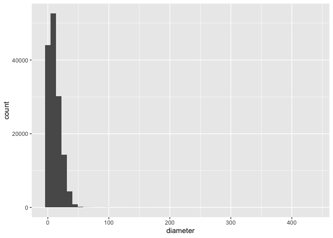
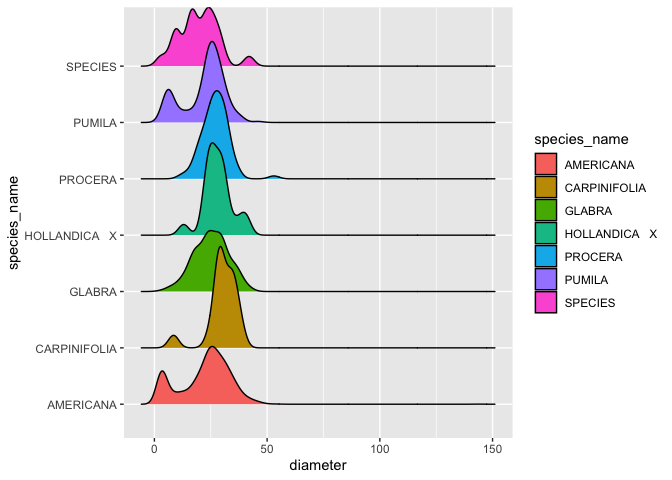

STAT545A Individual Mini Data Analysis
================
Sara Kowalski
October 9, 2021

## Table of Contents

1.  Introduction

2.  Install and load packages

    -   2.1 Install **datateachr**
    -   2.2 Load **datateachr** and **tidyverse**

3.  Task 1: Choosing a dataset

    -   3.1 Choose 4 datasets
    -   3.2 Explore the 4 datasets
        -   3.2.1 *vancouver_trees*
        -   3.2.2 *cancer_sample*
        -   3.2.3 *flow_sample*
        -   3.2.4 *steam_games*
    -   3.3 Narrowing it down to 2 datasets
    -   3.4 Final decision: choose a dataset

4.  Task 2: Exploring the dataset

    -   4.1 Diving deeper into the data
        -   4.1.1 Exercise 1
        -   4.1.2 Exercise 2
        -   4.1.3 Exercise 3
        -   4.1.4 Exercise 4

5.  Task 3: Research questions

    -   5.1 Question #1
    -   5.2 Question #2
    -   5.3 Question #3
    -   5.4 Question #4

## 1 Introduction

Hello! The following document contains the work required to complete
Milestone 1 of the Mini Data Analysis Project in STAT545A. Here I will
be using R, and more specifically the tidyverse packages within R, to
explore and visualize the data within the *vancouver_trees* dataset.

Much of the inspiration for this script comes from [Heads or
Tails](https://www.kaggle.com/headsortails/tidy-titarnic) and from the
[instructions](https://stat545.stat.ubc.ca/mini-project/mini-project-1/)
provided for the project.

## 2 Install and Load Packages

### 2.1 Install **datateachr**

``` r
## The following code must be commented out in order to knit the rmd file. If necessary, unncomment the
## following code to install the packages. 
## install.packages("devtools")
## devtools::install_github("UBC-MDS/datateachr")
```

### 2.2 Load **datateachr** and **tidyverse**

``` r
## Load dataset package - datateachr
library(datateachr)

## Load tidyverse - a collection of R packages 
library(tidyverse) 
```

    ## ── Attaching packages ─────────────────────────────────────── tidyverse 1.3.1 ──

    ## ✓ ggplot2 3.3.5     ✓ purrr   0.3.4
    ## ✓ tibble  3.1.4     ✓ dplyr   1.0.7
    ## ✓ tidyr   1.1.3     ✓ stringr 1.4.0
    ## ✓ readr   2.0.1     ✓ forcats 0.5.1

    ## ── Conflicts ────────────────────────────────────────── tidyverse_conflicts() ──
    ## x dplyr::filter() masks stats::filter()
    ## x dplyr::lag()    masks stats::lag()

## 3 Task 1: Choosing a dataset

### 3.1 Choose 4 datasets

Within the **datateachr** package by Hayley Boyce and Jordan Bourak,
there are 7 available datasets. I have choosen 4 that interest me the
most to explore further:

**My 4 Choices**

1.  *vancouver_trees*
2.  *cancer_sample*
3.  *flow_sample*
4.  *steam_games*

### 3.2 Explore the 4 datasets

To narrow down the datasets and make a decision on which one to choose,
I have explored each dataset using the *class*, *summary*, and *glimpse*
functions

-   *Class* function: provides the class(es) the specified object called
    is from
-   *Summary* function: provides a description for each column within
    the specified dataset
-   *Glimpse* function: produces the observations and variables
    contained in the specified dataset, along with a brief look at the
    oultine of the dataset

#### 3.2.1 *vancouver_trees*

Exploring the *vancouver_trees* dataset that is courtesy of The City of
Vancouver’s Open Data Portal.

``` r
## explore the *vancouver_trees* dataset using the class, summary, and glimpse functions
class(vancouver_trees)
```

    ## [1] "tbl_df"     "tbl"        "data.frame"

``` r
summary(vancouver_trees)
```

    ##     tree_id        civic_number    std_street         genus_name       
    ##  Min.   :    12   Min.   :    0   Length:146611      Length:146611     
    ##  1st Qu.: 65464   1st Qu.: 1306   Class :character   Class :character  
    ##  Median :134903   Median : 2604   Mode  :character   Mode  :character  
    ##  Mean   :131892   Mean   : 2937                                        
    ##  3rd Qu.:194450   3rd Qu.: 4005                                        
    ##  Max.   :266203   Max.   :17888                                        
    ##                                                                        
    ##  species_name       cultivar_name      common_name          assigned        
    ##  Length:146611      Length:146611      Length:146611      Length:146611     
    ##  Class :character   Class :character   Class :character   Class :character  
    ##  Mode  :character   Mode  :character   Mode  :character   Mode  :character  
    ##                                                                             
    ##                                                                             
    ##                                                                             
    ##                                                                             
    ##  root_barrier        plant_area        on_street_block  on_street        
    ##  Length:146611      Length:146611      Min.   :   0    Length:146611     
    ##  Class :character   Class :character   1st Qu.:1300    Class :character  
    ##  Mode  :character   Mode  :character   Median :2600    Mode  :character  
    ##                                        Mean   :2909                      
    ##                                        3rd Qu.:4000                      
    ##                                        Max.   :9900                      
    ##                                                                          
    ##  neighbourhood_name street_side_name   height_range_id     diameter     
    ##  Length:146611      Length:146611      Min.   : 0.000   Min.   :  0.00  
    ##  Class :character   Class :character   1st Qu.: 1.000   1st Qu.:  3.50  
    ##  Mode  :character   Mode  :character   Median : 2.000   Median :  9.00  
    ##                                        Mean   : 2.627   Mean   : 11.49  
    ##                                        3rd Qu.: 4.000   3rd Qu.: 16.50  
    ##                                        Max.   :10.000   Max.   :435.00  
    ##                                                                         
    ##      curb            date_planted          longitude         latitude    
    ##  Length:146611      Min.   :1989-10-27   Min.   :-123.2   Min.   :49.20  
    ##  Class :character   1st Qu.:1998-02-23   1st Qu.:-123.1   1st Qu.:49.23  
    ##  Mode  :character   Median :2004-01-28   Median :-123.1   Median :49.25  
    ##                     Mean   :2004-04-07   Mean   :-123.1   Mean   :49.25  
    ##                     3rd Qu.:2010-03-02   3rd Qu.:-123.1   3rd Qu.:49.26  
    ##                     Max.   :2019-07-03   Max.   :-123.0   Max.   :49.29  
    ##                     NA's   :76548        NA's   :22771    NA's   :22771

``` r
glimpse(vancouver_trees)
```

    ## Rows: 146,611
    ## Columns: 20
    ## $ tree_id            <dbl> 149556, 149563, 149579, 149590, 149604, 149616, 149…
    ## $ civic_number       <dbl> 494, 450, 4994, 858, 5032, 585, 4909, 4925, 4969, 7…
    ## $ std_street         <chr> "W 58TH AV", "W 58TH AV", "WINDSOR ST", "E 39TH AV"…
    ## $ genus_name         <chr> "ULMUS", "ZELKOVA", "STYRAX", "FRAXINUS", "ACER", "…
    ## $ species_name       <chr> "AMERICANA", "SERRATA", "JAPONICA", "AMERICANA", "C…
    ## $ cultivar_name      <chr> "BRANDON", NA, NA, "AUTUMN APPLAUSE", NA, "CHANTICL…
    ## $ common_name        <chr> "BRANDON ELM", "JAPANESE ZELKOVA", "JAPANESE SNOWBE…
    ## $ assigned           <chr> "N", "N", "N", "Y", "N", "N", "N", "N", "N", "N", "…
    ## $ root_barrier       <chr> "N", "N", "N", "N", "N", "N", "N", "N", "N", "N", "…
    ## $ plant_area         <chr> "N", "N", "4", "4", "4", "B", "6", "6", "3", "3", "…
    ## $ on_street_block    <dbl> 400, 400, 4900, 800, 5000, 500, 4900, 4900, 4900, 7…
    ## $ on_street          <chr> "W 58TH AV", "W 58TH AV", "WINDSOR ST", "E 39TH AV"…
    ## $ neighbourhood_name <chr> "MARPOLE", "MARPOLE", "KENSINGTON-CEDAR COTTAGE", "…
    ## $ street_side_name   <chr> "EVEN", "EVEN", "EVEN", "EVEN", "EVEN", "ODD", "ODD…
    ## $ height_range_id    <dbl> 2, 4, 3, 4, 2, 2, 3, 3, 2, 2, 2, 5, 3, 2, 2, 2, 2, …
    ## $ diameter           <dbl> 10.00, 10.00, 4.00, 18.00, 9.00, 5.00, 15.00, 14.00…
    ## $ curb               <chr> "N", "N", "Y", "Y", "Y", "Y", "Y", "Y", "Y", "Y", "…
    ## $ date_planted       <date> 1999-01-13, 1996-05-31, 1993-11-22, 1996-04-29, 19…
    ## $ longitude          <dbl> -123.1161, -123.1147, -123.0846, -123.0870, -123.08…
    ## $ latitude           <dbl> 49.21776, 49.21776, 49.23938, 49.23469, 49.23894, 4…

Attributes of the *vancouver_trees* dataset:

-   146 611 rows
-   20 columns:
    -   Numeric columns (7)
    -   Character columns (12)
    -   Date column (1)
-   column **cultivar_name** contains NA values
-   classes:
    -   tbl_df
    -   tbl
    -   data.frame

#### 3.2.2 *cancer_sample*

Exploring the *cancer_sample* dataset that is courtesy of UCI Machine
Learning Repository.

``` r
## explore the *cancer_sample* dataset using the class, summary, and glimpse functions
class(cancer_sample)
```

    ## [1] "spec_tbl_df" "tbl_df"      "tbl"         "data.frame"

``` r
summary(cancer_sample)
```

    ##        ID             diagnosis          radius_mean      texture_mean  
    ##  Min.   :     8670   Length:569         Min.   : 6.981   Min.   : 9.71  
    ##  1st Qu.:   869218   Class :character   1st Qu.:11.700   1st Qu.:16.17  
    ##  Median :   906024   Mode  :character   Median :13.370   Median :18.84  
    ##  Mean   : 30371831                      Mean   :14.127   Mean   :19.29  
    ##  3rd Qu.:  8813129                      3rd Qu.:15.780   3rd Qu.:21.80  
    ##  Max.   :911320502                      Max.   :28.110   Max.   :39.28  
    ##  perimeter_mean     area_mean      smoothness_mean   compactness_mean 
    ##  Min.   : 43.79   Min.   : 143.5   Min.   :0.05263   Min.   :0.01938  
    ##  1st Qu.: 75.17   1st Qu.: 420.3   1st Qu.:0.08637   1st Qu.:0.06492  
    ##  Median : 86.24   Median : 551.1   Median :0.09587   Median :0.09263  
    ##  Mean   : 91.97   Mean   : 654.9   Mean   :0.09636   Mean   :0.10434  
    ##  3rd Qu.:104.10   3rd Qu.: 782.7   3rd Qu.:0.10530   3rd Qu.:0.13040  
    ##  Max.   :188.50   Max.   :2501.0   Max.   :0.16340   Max.   :0.34540  
    ##  concavity_mean    concave_points_mean symmetry_mean    fractal_dimension_mean
    ##  Min.   :0.00000   Min.   :0.00000     Min.   :0.1060   Min.   :0.04996       
    ##  1st Qu.:0.02956   1st Qu.:0.02031     1st Qu.:0.1619   1st Qu.:0.05770       
    ##  Median :0.06154   Median :0.03350     Median :0.1792   Median :0.06154       
    ##  Mean   :0.08880   Mean   :0.04892     Mean   :0.1812   Mean   :0.06280       
    ##  3rd Qu.:0.13070   3rd Qu.:0.07400     3rd Qu.:0.1957   3rd Qu.:0.06612       
    ##  Max.   :0.42680   Max.   :0.20120     Max.   :0.3040   Max.   :0.09744       
    ##    radius_se        texture_se      perimeter_se       area_se       
    ##  Min.   :0.1115   Min.   :0.3602   Min.   : 0.757   Min.   :  6.802  
    ##  1st Qu.:0.2324   1st Qu.:0.8339   1st Qu.: 1.606   1st Qu.: 17.850  
    ##  Median :0.3242   Median :1.1080   Median : 2.287   Median : 24.530  
    ##  Mean   :0.4052   Mean   :1.2169   Mean   : 2.866   Mean   : 40.337  
    ##  3rd Qu.:0.4789   3rd Qu.:1.4740   3rd Qu.: 3.357   3rd Qu.: 45.190  
    ##  Max.   :2.8730   Max.   :4.8850   Max.   :21.980   Max.   :542.200  
    ##  smoothness_se      compactness_se      concavity_se     concave_points_se 
    ##  Min.   :0.001713   Min.   :0.002252   Min.   :0.00000   Min.   :0.000000  
    ##  1st Qu.:0.005169   1st Qu.:0.013080   1st Qu.:0.01509   1st Qu.:0.007638  
    ##  Median :0.006380   Median :0.020450   Median :0.02589   Median :0.010930  
    ##  Mean   :0.007041   Mean   :0.025478   Mean   :0.03189   Mean   :0.011796  
    ##  3rd Qu.:0.008146   3rd Qu.:0.032450   3rd Qu.:0.04205   3rd Qu.:0.014710  
    ##  Max.   :0.031130   Max.   :0.135400   Max.   :0.39600   Max.   :0.052790  
    ##   symmetry_se       fractal_dimension_se  radius_worst   texture_worst  
    ##  Min.   :0.007882   Min.   :0.0008948    Min.   : 7.93   Min.   :12.02  
    ##  1st Qu.:0.015160   1st Qu.:0.0022480    1st Qu.:13.01   1st Qu.:21.08  
    ##  Median :0.018730   Median :0.0031870    Median :14.97   Median :25.41  
    ##  Mean   :0.020542   Mean   :0.0037949    Mean   :16.27   Mean   :25.68  
    ##  3rd Qu.:0.023480   3rd Qu.:0.0045580    3rd Qu.:18.79   3rd Qu.:29.72  
    ##  Max.   :0.078950   Max.   :0.0298400    Max.   :36.04   Max.   :49.54  
    ##  perimeter_worst    area_worst     smoothness_worst  compactness_worst
    ##  Min.   : 50.41   Min.   : 185.2   Min.   :0.07117   Min.   :0.02729  
    ##  1st Qu.: 84.11   1st Qu.: 515.3   1st Qu.:0.11660   1st Qu.:0.14720  
    ##  Median : 97.66   Median : 686.5   Median :0.13130   Median :0.21190  
    ##  Mean   :107.26   Mean   : 880.6   Mean   :0.13237   Mean   :0.25427  
    ##  3rd Qu.:125.40   3rd Qu.:1084.0   3rd Qu.:0.14600   3rd Qu.:0.33910  
    ##  Max.   :251.20   Max.   :4254.0   Max.   :0.22260   Max.   :1.05800  
    ##  concavity_worst  concave_points_worst symmetry_worst   fractal_dimension_worst
    ##  Min.   :0.0000   Min.   :0.00000      Min.   :0.1565   Min.   :0.05504        
    ##  1st Qu.:0.1145   1st Qu.:0.06493      1st Qu.:0.2504   1st Qu.:0.07146        
    ##  Median :0.2267   Median :0.09993      Median :0.2822   Median :0.08004        
    ##  Mean   :0.2722   Mean   :0.11461      Mean   :0.2901   Mean   :0.08395        
    ##  3rd Qu.:0.3829   3rd Qu.:0.16140      3rd Qu.:0.3179   3rd Qu.:0.09208        
    ##  Max.   :1.2520   Max.   :0.29100      Max.   :0.6638   Max.   :0.20750

``` r
glimpse(cancer_sample)
```

    ## Rows: 569
    ## Columns: 32
    ## $ ID                      <dbl> 842302, 842517, 84300903, 84348301, 84358402, …
    ## $ diagnosis               <chr> "M", "M", "M", "M", "M", "M", "M", "M", "M", "…
    ## $ radius_mean             <dbl> 17.990, 20.570, 19.690, 11.420, 20.290, 12.450…
    ## $ texture_mean            <dbl> 10.38, 17.77, 21.25, 20.38, 14.34, 15.70, 19.9…
    ## $ perimeter_mean          <dbl> 122.80, 132.90, 130.00, 77.58, 135.10, 82.57, …
    ## $ area_mean               <dbl> 1001.0, 1326.0, 1203.0, 386.1, 1297.0, 477.1, …
    ## $ smoothness_mean         <dbl> 0.11840, 0.08474, 0.10960, 0.14250, 0.10030, 0…
    ## $ compactness_mean        <dbl> 0.27760, 0.07864, 0.15990, 0.28390, 0.13280, 0…
    ## $ concavity_mean          <dbl> 0.30010, 0.08690, 0.19740, 0.24140, 0.19800, 0…
    ## $ concave_points_mean     <dbl> 0.14710, 0.07017, 0.12790, 0.10520, 0.10430, 0…
    ## $ symmetry_mean           <dbl> 0.2419, 0.1812, 0.2069, 0.2597, 0.1809, 0.2087…
    ## $ fractal_dimension_mean  <dbl> 0.07871, 0.05667, 0.05999, 0.09744, 0.05883, 0…
    ## $ radius_se               <dbl> 1.0950, 0.5435, 0.7456, 0.4956, 0.7572, 0.3345…
    ## $ texture_se              <dbl> 0.9053, 0.7339, 0.7869, 1.1560, 0.7813, 0.8902…
    ## $ perimeter_se            <dbl> 8.589, 3.398, 4.585, 3.445, 5.438, 2.217, 3.18…
    ## $ area_se                 <dbl> 153.40, 74.08, 94.03, 27.23, 94.44, 27.19, 53.…
    ## $ smoothness_se           <dbl> 0.006399, 0.005225, 0.006150, 0.009110, 0.0114…
    ## $ compactness_se          <dbl> 0.049040, 0.013080, 0.040060, 0.074580, 0.0246…
    ## $ concavity_se            <dbl> 0.05373, 0.01860, 0.03832, 0.05661, 0.05688, 0…
    ## $ concave_points_se       <dbl> 0.015870, 0.013400, 0.020580, 0.018670, 0.0188…
    ## $ symmetry_se             <dbl> 0.03003, 0.01389, 0.02250, 0.05963, 0.01756, 0…
    ## $ fractal_dimension_se    <dbl> 0.006193, 0.003532, 0.004571, 0.009208, 0.0051…
    ## $ radius_worst            <dbl> 25.38, 24.99, 23.57, 14.91, 22.54, 15.47, 22.8…
    ## $ texture_worst           <dbl> 17.33, 23.41, 25.53, 26.50, 16.67, 23.75, 27.6…
    ## $ perimeter_worst         <dbl> 184.60, 158.80, 152.50, 98.87, 152.20, 103.40,…
    ## $ area_worst              <dbl> 2019.0, 1956.0, 1709.0, 567.7, 1575.0, 741.6, …
    ## $ smoothness_worst        <dbl> 0.1622, 0.1238, 0.1444, 0.2098, 0.1374, 0.1791…
    ## $ compactness_worst       <dbl> 0.6656, 0.1866, 0.4245, 0.8663, 0.2050, 0.5249…
    ## $ concavity_worst         <dbl> 0.71190, 0.24160, 0.45040, 0.68690, 0.40000, 0…
    ## $ concave_points_worst    <dbl> 0.26540, 0.18600, 0.24300, 0.25750, 0.16250, 0…
    ## $ symmetry_worst          <dbl> 0.4601, 0.2750, 0.3613, 0.6638, 0.2364, 0.3985…
    ## $ fractal_dimension_worst <dbl> 0.11890, 0.08902, 0.08758, 0.17300, 0.07678, 0…

Attributes of the *cancer_sample* dataset:

-   569 rows
-   32 columns:
    -   Numeric columns (31)
    -   Character columns (1)
-   classes:
    -   spec_tbl_df
    -   tbl_df
    -   tbl
    -   data.frame

#### 3.2.3 *flow_sample*

Exploring the *flow_sample* dataset that is courtesy of The Government
of Canada’s Historical Hydrometric Database.

``` r
## explore the *flow_sample* dataset using the class, summary, and glimpse functions
class(flow_sample)
```

    ## [1] "tbl_df"     "tbl"        "data.frame"

``` r
summary(flow_sample)
```

    ##   station_id             year      extreme_type           month       
    ##  Length:218         Min.   :1909   Length:218         Min.   : 1.000  
    ##  Class :character   1st Qu.:1936   Class :character   1st Qu.: 3.000  
    ##  Mode  :character   Median :1963   Mode  :character   Median : 6.000  
    ##                     Mean   :1963                      Mean   : 5.046  
    ##                     3rd Qu.:1990                      3rd Qu.: 6.000  
    ##                     Max.   :2018                      Max.   :12.000  
    ##                                                       NA's   :2       
    ##       day             flow            sym           
    ##  Min.   : 1.00   Min.   :  3.62   Length:218        
    ##  1st Qu.: 8.00   1st Qu.:  6.18   Class :character  
    ##  Median :17.00   Median :114.00   Mode  :character  
    ##  Mean   :16.24   Mean   :110.13                     
    ##  3rd Qu.:25.00   3rd Qu.:204.25                     
    ##  Max.   :31.00   Max.   :466.00                     
    ##  NA's   :2       NA's   :2

``` r
glimpse(flow_sample)
```

    ## Rows: 218
    ## Columns: 7
    ## $ station_id   <chr> "05BB001", "05BB001", "05BB001", "05BB001", "05BB001", "0…
    ## $ year         <dbl> 1909, 1910, 1911, 1912, 1913, 1914, 1915, 1916, 1917, 191…
    ## $ extreme_type <chr> "maximum", "maximum", "maximum", "maximum", "maximum", "m…
    ## $ month        <dbl> 7, 6, 6, 8, 6, 6, 6, 6, 6, 6, 6, 7, 6, 6, 6, 7, 5, 7, 6, …
    ## $ day          <dbl> 7, 12, 14, 25, 11, 18, 27, 20, 17, 15, 22, 3, 9, 5, 14, 5…
    ## $ flow         <dbl> 314, 230, 264, 174, 232, 214, 236, 309, 174, 345, 185, 24…
    ## $ sym          <chr> NA, NA, NA, NA, NA, NA, NA, NA, NA, NA, NA, NA, NA, NA, N…

Attributes of the *flow_sample* dataset:

-   218 rows
-   7 columns:
    -   Numeric columns (4)
    -   Character columns (3)
-   columns **month**, **day**, **flow**, and **sym** contain NA values
-   classes:
    -   tbl_df
    -   tbl
    -   data.frame

#### 3.2.4 *steam_games*

Exploring the *steam_games* dataset that is courtesy of Kaggle.

``` r
## explore the *steam_games* dataset using the class, summary, and glimpse functions
class(steam_games)
```

    ## [1] "spec_tbl_df" "tbl_df"      "tbl"         "data.frame"

``` r
##summary(steam_games)
##glimpse(steam_games)
```

Attributes of the *steam_games* dataset:

-   40 833 rows
-   21 columns:
    -   Numeric columns (4)
    -   Character columns (17)
-   columns **achievements**, **mature_content**, **original_price**,
    and **discount_price** contain NA values
-   classes:
    -   spec_tbl_df
    -   tbl_df
    -   tbl
    -   data.frame

### 3.3 Narrowing it down to 2 datasets

After a brief exploration of all 4 datasets, I have narrowed my decision
down to 2 datasets:

    1.  *vancouver_trees*
    2.  *cancer_sample*

**Why these datasets?** Both of these data sets contain the most numeric
variables (*vancouver_trees* (7); *cancer_sample* (31)) out of all 4
datasets I have explored. This will allow me to have more freedom when
exploring and graphing the data as there are more options for
manipulating and displaying numeric data compared to character data
(i.e. mathematical manipulations, distribution graphs, etc). As well,
the high number of columns in both datasets allows for me to ask more
in-depth, complex questions about the data and test different
combinations of columns. Overall, both of these datasets contain a vast
amount of information that gives me the opportunity to develop
intriguing and thought provoking research questions that I will answer
in Milestones 2 and 3 of this Mini Data Analysis Project. And it does
not hurt that I am very passionate about hiking and the outdoors and am
currently doing my Master’s Thesis in a cancer biology lab, making both
of these datasets very up my alley!

### 3.4 Final decision: choose a dataset

In choosing my final dataset, I have formulated 1 research question for
each dataset that I would be interested in exploring:

1.  *vancouver_trees*: How have the number of trees planted within each
    neighbourhood changed over time?

2.  *cancer_sample*: Does the radius of the sample impact the patient’s
    diagnosis (Malignant (M) vs. Benign (B))?

**Final Decision: *vancouver_trees* **

I have chosen the *vancouver_trees* dataset to work with throughout this
Mini Data Analysis Project because I found it fitting seeing as I am
currently living in Vancouver and love everything to do with the
outdoors and exploring nature. Plus, I am currently surrounded by all
things cancer for my masters, so exploring the *vancouver_trees* dataset
will be a nice breath of fresh air :)

## 4 Task 2: Exploring the dataset

### 4.1 Diving deeper into the data

To dive deeper and further explore the *vancouver_trees* dataset, I have
completed 4 exercises. This will aid in my understanding of the dataset
and help the development of more meaningful questions to be answered in
future milestones.

#### 4.1.1 Exercise 1

I have choosen to create a density plot that contains the distribution
of the diameters of the trees contained in the dataset. Since the
*vancouver_trees* dataset has a very high number of rows (i.e. lots of
trees), I am able to easily visualize all of my data in one plot and see
if there is a large or wide distribution of tree diameters in the data
or if the distribution is narrow. This will then allow me to decided
whether I want to further filter or subset my data down to look at
specific groups of trees (e.g. trees with a large diameter) which will
also shrink the amount of data within my dataset making it easier to
work with and explore certain relationships between other variables.

``` r
## Plotting the distribution of the diameter of the trees 
## use the ggplot function for visualizations
ggplot(vancouver_trees, aes(diameter)) + ## histograms only require that x is a numeric vector 
  geom_histogram(bins = 50) ## bins specifies the number of bars shown in the plot
```

<!-- -->

#### 4.1.2 Exercise 2

I have decided to filter the observations in the *vancouver_trees*
dataset so I am able to better explore the tree data I am most
interested in. The *vancouver_trees* dataset is quite a large dataset
containing 146611 rows. This means there are a lot of different listed
species, genus, and common names for the trees within the data set, and
that makes it extremely difficult to graph any of those variables or
their relationship with the other variables within the dataset. By
filtering down the data (in this case to only contain trees with the
genus Ulmus), I am better able to visualze the tree data as it is no
longer squished or ‘running’ off the screen.

``` r
## Filtering the data using the dplyr filter function 
## create a variable that holds a subset of the data and give it a descriptive name
ulmusGenus <- vancouver_trees %>%
## filter the data so only trees with the genus name ULMUS remain
  filter(genus_name == "ULMUS")
## visualize your new subsetted dataset
print(ulmusGenus)
```

    ## # A tibble: 2,861 × 20
    ##    tree_id civic_number std_street  genus_name species_name cultivar_name
    ##      <dbl>        <dbl> <chr>       <chr>      <chr>        <chr>        
    ##  1  149556          494 W 58TH AV   ULMUS      AMERICANA    BRANDON      
    ##  2  155413         2485 W BROADWAY  ULMUS      AMERICANA    BRANDON      
    ##  3  157229         1846 VENABLES ST ULMUS      AMERICANA    <NA>         
    ##  4  157448         2555 ARBUTUS ST  ULMUS      GLABRA       <NA>         
    ##  5  157449         2555 ARBUTUS ST  ULMUS      GLABRA       <NA>         
    ##  6  157494         3448 W 28TH AV   ULMUS      GLABRA       <NA>         
    ##  7  159619         2715 W 38TH AV   ULMUS      AMERICANA    <NA>         
    ##  8  159863          889 KEEFER ST   ULMUS      GLABRA       <NA>         
    ##  9  159939         3985 HUDSON ST   ULMUS      AMERICANA    BRANDON      
    ## 10  161308         3477 W 28TH AV   ULMUS      AMERICANA    BRANDON      
    ## # … with 2,851 more rows, and 14 more variables: common_name <chr>,
    ## #   assigned <chr>, root_barrier <chr>, plant_area <chr>,
    ## #   on_street_block <dbl>, on_street <chr>, neighbourhood_name <chr>,
    ## #   street_side_name <chr>, height_range_id <dbl>, diameter <dbl>, curb <chr>,
    ## #   date_planted <date>, longitude <dbl>, latitude <dbl>

#### 4.1.3 Exercise 3

Using a ridge plot to look at the relationship between the diameter of
the trees for each species within the Ulmus genus. I want to explore the
relationship between two variables in the dataset so I have decided to
look at the relationship between a categorical variable (species) and a
numerical variable (diameter) to see how they relate. This way I can see
the distribution of tree diameters within a species and determine if
certain tree species within the Ulmus genus have larger diameters than
others or if there is a large distribution of tree diameters within a
species, etc.

**I will be using the filtered data, ulmusGenus, obtained from exercise
2 as the full *vancouver_trees* dataset is too large to plot the
frequency of trees in all the genus’ listed. If I were to use the whole
*vancouver_trees* dataset, the graph would be extremely long and very
crowded it would be nearly impossible to make meaningful observations
about the data**

``` r
## use ggplot to visualize the data
## call the dataset you wish to use and then specify which variables within that dataset you would like to graph
## chose to graph the categorical variable on the y axis to clean up the presentation of the data and prevent crowding 
ggplot(ulmusGenus, aes(diameter, species_name)) +
## chose to 
  ggridges::geom_density_ridges(aes(fill = species_name))
```

    ## Picking joint bandwidth of 2.34

<!-- -->

#### 4.1.4 Exercise 4

I have chosen to create a new variable called species_diameter_mean
which will hold the mean tree diameter for each species listed in the
dataset. I could also create a new varibale called genus_diameter_mean
which would hold the mean tree diameter for each genus in the dataset
and give a more global or zoomed out view of the data. Creating these
new variables will let me explore new relationships will other variables
more easily (less data to work with = less crowded graphs) and from a
new angle.

``` r
## use the dplyr function mutate to create a new variable called species_diameter_mean in the
## *vancouver_trees* dataset
## call the dataset
vancouver_trees %>%
## group by species_name to group together the species in the dataset 
  group_by(species_name) %>%
## use mutate to add the new variable species_diameter_mean by calculating the mean diameter of the trees  ## within each species and assigning the output to the new specified variable. This works because mutate   ## honors the group function.
  mutate(species_diameter_mean = mean(diameter))
```

    ## # A tibble: 146,611 × 21
    ## # Groups:   species_name [283]
    ##    tree_id civic_number std_street    genus_name species_name cultivar_name  
    ##      <dbl>        <dbl> <chr>         <chr>      <chr>        <chr>          
    ##  1  149556          494 W 58TH AV     ULMUS      AMERICANA    BRANDON        
    ##  2  149563          450 W 58TH AV     ZELKOVA    SERRATA      <NA>           
    ##  3  149579         4994 WINDSOR ST    STYRAX     JAPONICA     <NA>           
    ##  4  149590          858 E 39TH AV     FRAXINUS   AMERICANA    AUTUMN APPLAUSE
    ##  5  149604         5032 WINDSOR ST    ACER       CAMPESTRE    <NA>           
    ##  6  149616          585 W 61ST AV     PYRUS      CALLERYANA   CHANTICLEER    
    ##  7  149617         4909 SHERBROOKE ST ACER       PLATANOIDES  COLUMNARE      
    ##  8  149618         4925 SHERBROOKE ST ACER       PLATANOIDES  COLUMNARE      
    ##  9  149619         4969 SHERBROOKE ST ACER       PLATANOIDES  COLUMNARE      
    ## 10  149625          720 E 39TH AV     FRAXINUS   AMERICANA    AUTUMN APPLAUSE
    ## # … with 146,601 more rows, and 15 more variables: common_name <chr>,
    ## #   assigned <chr>, root_barrier <chr>, plant_area <chr>,
    ## #   on_street_block <dbl>, on_street <chr>, neighbourhood_name <chr>,
    ## #   street_side_name <chr>, height_range_id <dbl>, diameter <dbl>, curb <chr>,
    ## #   date_planted <date>, longitude <dbl>, latitude <dbl>,
    ## #   species_diameter_mean <dbl>

``` r
## use the dplyr function mutate to create a new variable called genus_diameter_mean in the
## *vancouver_trees* dataset
## call the dataset
vancouver_trees %>%
## group by genus_name to group together the genus' in the dataset 
  group_by(genus_name) %>%
## use mutate to add the new variable genus_diameter_mean by calculating the mean diameter of the trees  ## within each genus and assigning the output to the new specified variable. This works because mutate   ## honors the group function.
  mutate(genus_diameter_mean = mean(diameter))
```

    ## # A tibble: 146,611 × 21
    ## # Groups:   genus_name [97]
    ##    tree_id civic_number std_street    genus_name species_name cultivar_name  
    ##      <dbl>        <dbl> <chr>         <chr>      <chr>        <chr>          
    ##  1  149556          494 W 58TH AV     ULMUS      AMERICANA    BRANDON        
    ##  2  149563          450 W 58TH AV     ZELKOVA    SERRATA      <NA>           
    ##  3  149579         4994 WINDSOR ST    STYRAX     JAPONICA     <NA>           
    ##  4  149590          858 E 39TH AV     FRAXINUS   AMERICANA    AUTUMN APPLAUSE
    ##  5  149604         5032 WINDSOR ST    ACER       CAMPESTRE    <NA>           
    ##  6  149616          585 W 61ST AV     PYRUS      CALLERYANA   CHANTICLEER    
    ##  7  149617         4909 SHERBROOKE ST ACER       PLATANOIDES  COLUMNARE      
    ##  8  149618         4925 SHERBROOKE ST ACER       PLATANOIDES  COLUMNARE      
    ##  9  149619         4969 SHERBROOKE ST ACER       PLATANOIDES  COLUMNARE      
    ## 10  149625          720 E 39TH AV     FRAXINUS   AMERICANA    AUTUMN APPLAUSE
    ## # … with 146,601 more rows, and 15 more variables: common_name <chr>,
    ## #   assigned <chr>, root_barrier <chr>, plant_area <chr>,
    ## #   on_street_block <dbl>, on_street <chr>, neighbourhood_name <chr>,
    ## #   street_side_name <chr>, height_range_id <dbl>, diameter <dbl>, curb <chr>,
    ## #   date_planted <date>, longitude <dbl>, latitude <dbl>,
    ## #   genus_diameter_mean <dbl>

## 5 Task 3: Research questions

Now that I have explored and become familiar with the *vancouver_trees*
dataset, I am ready to generate my 4 research questions.

### 5.1 Question 1

What is the distribution for tree species (from a specified genus
(e.g. Ulmus)) within Vancouver neighbourhoods? Are certain tree species
favoured over others in specific neighbourhoods?

### 5.2 Question 2

How does the amount of trees planted change over time? Can go more in
depth and look at how this changes within the different Vancouver
neighbourhoods listed in the dataset. Or can look at how the number of
trees planted changes for each genus or species over time. Can also look
at a specific genus or species and see how the amount of trees planted
changes over time within a specific neighbourhood or all the
neighbourhoods in Vancouver.

### 5.3 Question 3

Within each genus, what is the distribution of the diameter of the trees
for each species? Which species have a wider diameter distribution and
which ones have a more narrow distribution?

### 5.4 Question 4

Which tree species are found planted on curbs? Does this vary by
neighbourhood? Does the diameter of the tree determine whether it is
planted on a curb (Y) or not (N) (i.e. large diameter trees would not be
planted on curbs and smaller diameter trees would be)? Will have to
group the trees by genus in order to pair down the dataset because for
this question, it is too vast to look at in its entirety.
